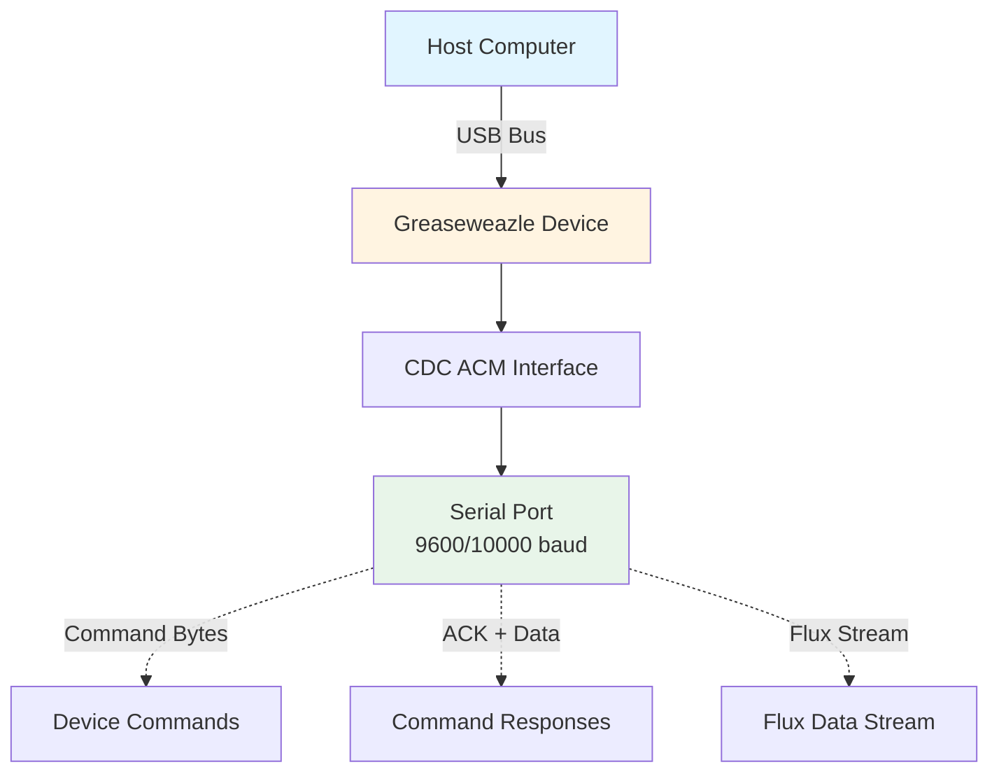
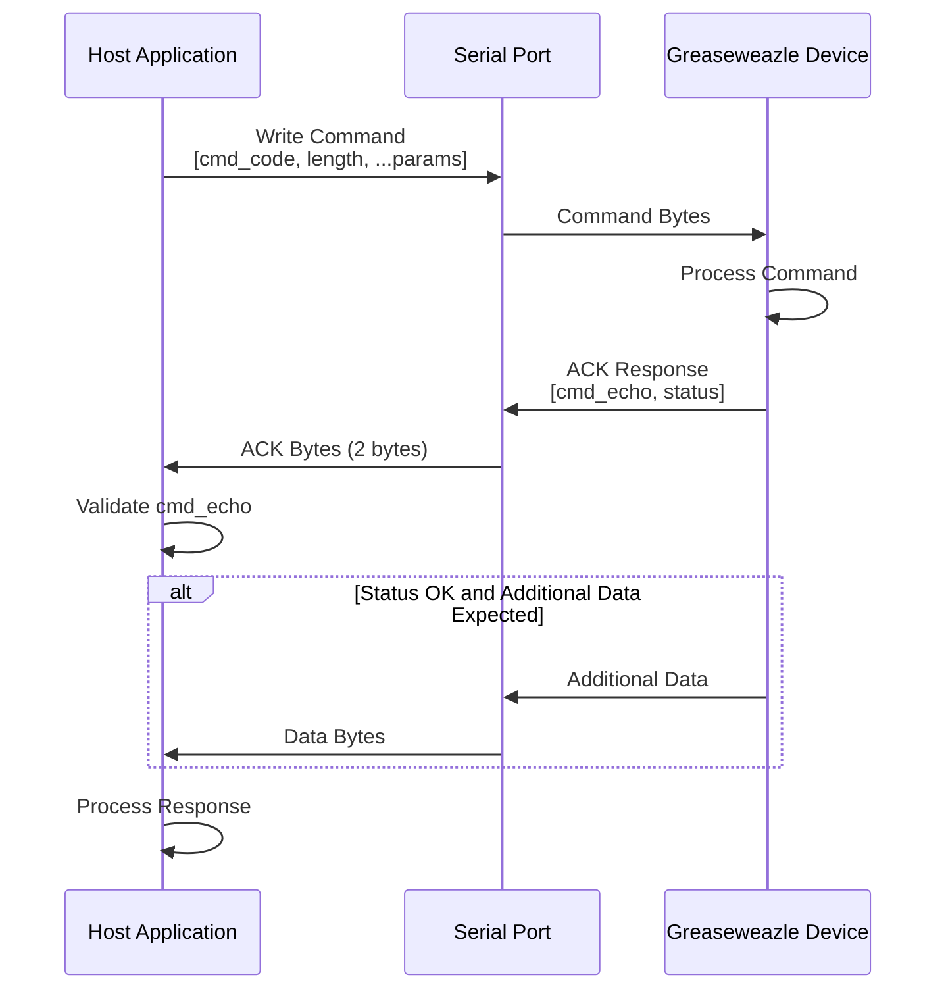
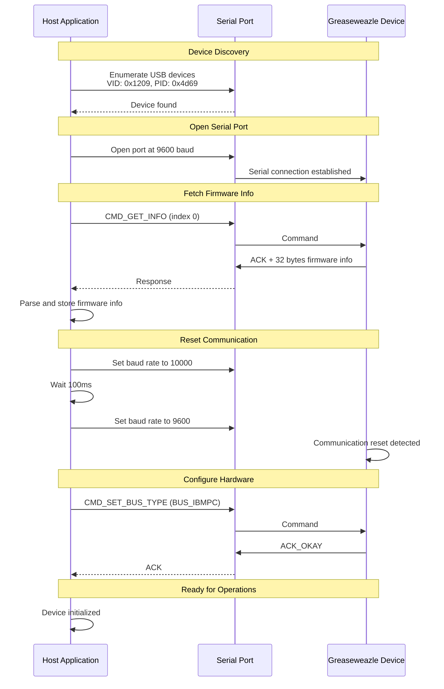
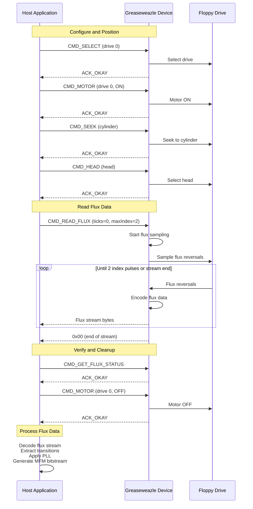

# Greaseweazle USB Protocol

**Documentation of the USB/serial communication protocol for Greaseweazle devices**

This document describes the USB/serial communication protocol used to communicate with Greaseweazle devices for controlling floppy drives and reading flux data. The Greaseweazle device uses CDC ACM (USB Serial) communication over a serial port interface.

---

## Table of Contents

1. [Introduction](#introduction)
2. [USB Device Identification](#usb-device-identification)
3. [Serial Communication Protocol](#serial-communication-protocol)
4. [Command Set](#command-set)
5. [ACK Return Codes](#ack-return-codes)
6. [GET_INFO Command Details](#get_info-command-details)
7. [Flux Data Format](#flux-data-format)
8. [Device Initialization Sequence](#device-initialization-sequence)
9. [Typical Operation Sequence](#typical-operation-sequence)
10. [Error Handling](#error-handling)
11. [Protocol Details](#protocol-details)
12. [Implementation Reference](#implementation-reference)

---

## Introduction

The Greaseweazle device communicates with the host computer via USB using **CDC ACM (USB Serial)** protocol:

- **Serial Port Communication**: All commands and data are sent over a serial port interface
- **Baud Rate**: 9600 baud for normal operation, 10000 baud for communication reset
- **Command-Response Model**: Commands are sent as byte arrays, and responses include ACK bytes followed by optional data

The protocol is designed to be efficient for high-speed flux reversal sampling and real-time floppy drive control.

**Note**: This documentation describes the protocol as implemented in this codebase. The protocol may vary slightly in different Greaseweazle firmware versions.

**Important**: Commands cannot be pipelined. Do not issue a new command until the previous command is completed with all expected bytes received by the host.

---

## USB Device Identification

### Device Descriptors

| Descriptor | Value | Description |
|------------|-------|-------------|
| **Vendor ID** | `0x1209` | Open source hardware projects vendor ID |
| **Product ID** | `0x4d69` | Keir Fraser Greaseweazle product ID |
| **Interface Type** | CDC ACM | USB Communication Device Class - Abstract Control Model (Serial) |

### Serial Port Communication

The Greaseweazle device appears as a USB serial port (CDC ACM device) on the host system. The device is identified by:

- **Vendor ID**: `0x1209`
- **Product ID**: `0x4d69`
- **Serial Number**: Unique serial number string (used for device identification)

The device is accessed via a serial port interface using standard serial port libraries (e.g., `go.bug.st/serial` in Go).

### USB Device Topology



---

## Serial Communication Protocol

### Baud Rate Configuration

| Mode | Baud Rate | Description |
|------|-----------|-------------|
| **Normal Operation** | `9600` | Standard communication speed for all commands |
| **Reset/Clear Comms** | `10000` | Used to reset/clear the communication stream |

**Baud Rate Twiddling**: During initialization, the baud rate is temporarily changed to 10000 baud and then back to 9600 baud. This signals to the Greaseweazle device that the data stream has been reset.

### Command Format

All commands are sent as byte arrays with the following format:

```
[command_code, length, ...parameters]
```

Where:
- **command_code** (1 byte): The command opcode (0-22)
- **length** (1 byte): Total length of the command packet in bytes
- **parameters** (variable): Command-specific parameters, encoded as little-endian for multi-byte values

**Example Command**:
```go
cmd := []byte{CMD_SEEK, 3, cylinder}  // Seek command: [0x02, 0x03, cylinder]
```

### ACK Response Format

After sending a command, the device responds with a 2-byte ACK:

```
[command_echo, status_code]
```

Where:
- **command_echo** (1 byte): Echo of the command code that was sent
- **status_code** (1 byte): Status/error code (0 = success, non-zero = error)

**Response Validation**: The implementation validates that `command_echo` matches the sent command code. If it doesn't match, the response is considered invalid.

### Additional Response Data

Some commands return additional data after the ACK:

- **CMD_GET_INFO**: Returns 32 bytes (firmware info) or 16 bytes (bandwidth stats) after ACK
- **CMD_GET_PIN**: Returns 1 byte (pin level: 0=Low, 1=High) after ACK
- **CMD_READ_FLUX**: Returns flux stream data (variable length, terminated by 0x00) after ACK

### Command Execution Model

**Important**: Commands cannot be pipelined. The host must:
1. Send a command
2. Wait for and read the ACK response (2 bytes)
3. If applicable, read any additional response data
4. Only then send the next command

Attempting to send a new command before the previous command completes will result in communication errors.

### Command Flow Diagram



---

## Command Set

All commands use the format `[command_code, length, ...parameters]` and return `[command_echo, status_code]` as ACK.

### `CMD_GET_INFO` (0)

**Purpose**: Get firmware, hardware, or drive information.

**Command Format**:
```
[CMD_GET_INFO, 3, index]
```

**Parameters**:
- `index` (1 byte): Information index
  - `0` = Firmware information (32 bytes)
  - `1` = Bandwidth statistics (16 bytes)
  - `7` = Current drive information
  - `8` = Drive 0 information
  - `9` = Drive 1 information

**Response**:
- ACK (2 bytes): `[CMD_GET_INFO, status]`
- Additional data: Variable length based on index (see [GET_INFO Command Details](#get_info-command-details))

**Usage**:
```go
cmd := []byte{CMD_GET_INFO, 3, GETINFO_FIRMWARE}
err := c.doCommand(cmd)
// Then read 32 bytes for firmware info
```

**Implementation**: [`greaseweazle/greaseweazle.go:240-284`](greaseweazle/greaseweazle.go)

---

### `CMD_UPDATE` (1)

**Purpose**: Update firmware (bootloader or main firmware).

**Command Format**:
- **Bootloader**: `[CMD_UPDATE, 6, update_len (le32)]`
- **Main Firmware**: `[CMD_UPDATE, 10, update_len (le32), 0xdeafbee3 (le32)]`

**Parameters**:
- `update_len` (uint32, little-endian): Size of firmware update in bytes
- `0xdeafbee3` (uint32, little-endian): Magic value for main firmware update

**Response**:
- ACK (2 bytes): `[CMD_UPDATE, status]`
- After ACK: Host sends `<update_len>` bytes of firmware data
- Final response: Status byte (0 = success)

**Note**: This command is used for firmware updates and is not implemented in the current codebase.

**Implementation**: Not implemented in current codebase.

---

### `CMD_SEEK` (2)

**Purpose**: Seek to a specific cylinder (track) on the selected drive.

**Command Format**:
```
[CMD_SEEK, 3, cylinder]  // For int8_t cylinder (-128 to 127)
[CMD_SEEK, 4, cylinder (le16)]  // For int16_t cylinder (-32768 to 32767)
```

**Parameters**:
- `cylinder` (1 or 2 bytes): Cylinder number
  - Length 3: Signed 8-bit cylinder (-128 to 127)
  - Length 4: Signed 16-bit cylinder (-32768 to 32767), little-endian

**Response**: ACK (2 bytes): `[CMD_SEEK, status]`

**Usage**:
```go
cmd := []byte{CMD_SEEK, 3, cylinder}  // For 0-127
err := c.doCommand(cmd)
```

**Implementation**: [`greaseweazle/greaseweazle.go:455-459`](greaseweazle/greaseweazle.go)

---

### `CMD_HEAD` (3)

**Purpose**: Select the floppy disk head (side).

**Command Format**:
```
[CMD_HEAD, 3, head]
```

**Parameters**:
- `head` (1 byte): Head number
  - `0` = Bottom head (side 0)
  - `1` = Top head (side 1)

**Response**: ACK (2 bytes): `[CMD_HEAD, status]`

**Usage**:
```go
cmd := []byte{CMD_HEAD, 3, head}  // head = 0 or 1
err := c.doCommand(cmd)
```

**Implementation**: [`greaseweazle/greaseweazle.go:461-465`](greaseweazle/greaseweazle.go)

---

### `CMD_SET_PARAMS` (4)

**Purpose**: Set device parameters.

**Command Format**:
```
[CMD_SET_PARAMS, 3+nr, index, <nr bytes>]
```

**Parameters**:
- `index` (1 byte): Parameter index
- `<nr bytes>` (variable): Parameter data

**Response**: ACK (2 bytes): `[CMD_SET_PARAMS, status]`

---

### `CMD_GET_PARAMS` (5)

**Purpose**: Get device parameters.

**Command Format**:
```
[CMD_GET_PARAMS, 4, index, nr_bytes]
```

**Parameters**:
- `index` (1 byte): Parameter index
- `nr_bytes` (1 byte): Number of bytes to read

**Response**:
- ACK (2 bytes): `[CMD_GET_PARAMS, status]`
- Additional data: `nr_bytes` bytes of parameter data

**Note**: Not implemented in current codebase.

---

### `CMD_MOTOR` (6)

**Purpose**: Turn the floppy drive motor on or off.

**Command Format**:
```
[CMD_MOTOR, 4, drive, state]
```

**Parameters**:
- `drive` (1 byte): Drive number (typically 0 or 1)
- `state` (1 byte): Motor state
  - `0` = Motor OFF
  - `1` = Motor ON

**Response**: ACK (2 bytes): `[CMD_MOTOR, status]`

**Usage**:
```go
cmd := []byte{CMD_MOTOR, 4, drive, motorState}  // motorState = 0 or 1
err := c.doCommand(cmd)
```

**Implementation**: [`greaseweazle/greaseweazle.go:473-481`](greaseweazle/greaseweazle.go)

---

### `CMD_READ_FLUX` (7)

**Purpose**: Read raw flux data from the current track.

**Command Format**:
```
[CMD_READ_FLUX, 8, ticks (le32), max_index (le16)]
[CMD_READ_FLUX, 12, ticks (le32), max_index (le16), max_index_linger (le32)]  // With optional field
```

**Parameters**:
- `ticks` (uint32, little-endian): Maximum ticks to read (0 = no limit)
- `max_index` (uint16, little-endian): Maximum index pulses to read (0 = no limit, typically 2 for 2 revolutions)
- `max_index_linger` (uint32, little-endian, optional): Linger time in ticks after max_index pulses (default: 500 microseconds)

**Response**:
- ACK (2 bytes): `[CMD_READ_FLUX, status]`
- Flux stream data: Variable length, terminated by `0x00` byte (end of stream marker)

**Flux Data Format**: See [Flux Data Format](#flux-data-format) section.

**Usage**:
```go
cmd := make([]byte, 8)
cmd[0] = CMD_READ_FLUX
cmd[1] = 8
binary.LittleEndian.PutUint32(cmd[2:6], ticks)
binary.LittleEndian.PutUint16(cmd[6:8], maxIndex)
err := c.doCommand(cmd)
// Then read flux data until 0x00 byte
```

**Implementation**: [`greaseweazle/greaseweazle.go:483-514`](greaseweazle/greaseweazle.go)

---

### `CMD_WRITE_FLUX` (8)

**Purpose**: Write flux data to the current track.

**Command Format**:
```
[CMD_WRITE_FLUX, 4, cue_at_index, terminate_at_index]
[CMD_WRITE_FLUX, 8, cue_at_index, terminate_at_index, hard_sector_ticks (le32)]  // With optional field
```

**Parameters**:
- `cue_at_index` (1 byte): If non-zero, start write at index pulse
- `terminate_at_index` (1 byte): If non-zero, terminate write at next index pulse
- `hard_sector_ticks` (uint32, little-endian, optional): Hard sector time in ticks (default: 0 = disabled)

**Response**:
- ACK (2 bytes): `[CMD_WRITE_FLUX, status]`
- After ACK: Host sends flux values terminating with `0x00` (end of stream marker)
- Final response: Status byte (0 = success)

**Note**: No further commands should be issued until the final status byte is received.

**Note**: Not implemented in current codebase.

---

### `CMD_GET_FLUX_STATUS` (9)

**Purpose**: Get the status of the last read/write flux operation.

**Command Format**:
```
[CMD_GET_FLUX_STATUS, 2]
```

**Parameters**: None

**Response**: ACK (2 bytes): `[CMD_GET_FLUX_STATUS, status]`
- The status byte in the ACK contains the flux operation status

**Usage**:
```go
cmd := []byte{CMD_GET_FLUX_STATUS, 2}
err := c.doCommand(cmd)
```

**Implementation**: [`greaseweazle/greaseweazle.go:516-520`](greaseweazle/greaseweazle.go)

---

### `CMD_SWITCH_FW_MODE` (11)

**Purpose**: Switch between bootloader and main firmware mode.

**Command Format**:
```
[CMD_SWITCH_FW_MODE, 3, mode]
```

**Parameters**:
- `mode` (1 byte): Firmware mode
  - `0` = Bootloader mode (`FW_MODE_BOOTLOADER`)
  - `1` = Normal/main firmware mode (`FW_MODE_NORMAL`)

**Response**:
- On success: No response (device resets and USB connection resets)
- On failure: ACK with error status

**Note**: After switching modes, the device resets and the USB connection also resets. The host must reconnect to the device.

**Note**: Not implemented in current codebase.

---

### `CMD_SELECT` (12)

**Purpose**: Select a drive as the current unit.

**Command Format**:
```
[CMD_SELECT, 3, drive]
```

**Parameters**:
- `drive` (1 byte): Drive number (typically 0 or 1)

**Response**: ACK (2 bytes): `[CMD_SELECT, status]`

**Usage**:
```go
cmd := []byte{CMD_SELECT, 3, drive}  // drive = 0 or 1
err := c.doCommand(cmd)
```

**Implementation**: [`greaseweazle/greaseweazle.go:467-471`](greaseweazle/greaseweazle.go)

---

### `CMD_DESELECT` (13)

**Purpose**: Deselect the current unit (if any).

**Command Format**:
```
[CMD_DESELECT, 2]
```

**Parameters**: None

**Response**: ACK (2 bytes): `[CMD_DESELECT, status]`

**Note**: Not implemented in current codebase.

---

### `CMD_SET_BUS_TYPE` (14)

**Purpose**: Set the floppy drive bus type.

**Command Format**:
```
[CMD_SET_BUS_TYPE, 3, bus_type]
```

**Parameters**:
- `bus_type` (1 byte): Bus type code
  - `0` = `BUS_NONE` (no bus)
  - `1` = `BUS_IBMPC` (IBM PC compatible)
  - `2` = `BUS_SHUGART` (Shugart interface)

**Response**: ACK (2 bytes): `[CMD_SET_BUS_TYPE, status]`

**Usage**:
```go
cmd := []byte{CMD_SET_BUS_TYPE, 3, BUS_IBMPC}
err := c.doCommand(cmd)
```

**Implementation**: [`greaseweazle/greaseweazle.go:142-148`](greaseweazle/greaseweazle.go)

---

### `CMD_SET_PIN` (15)

**Purpose**: Set a pin level.

**Command Format**:
```
[CMD_SET_PIN, 4, pin, level]
```

**Parameters**:
- `pin` (1 byte): Pin number
- `level` (1 byte): Pin level
  - `0` = Low
  - `1` = High

**Response**: ACK (2 bytes): `[CMD_SET_PIN, status]`

**Note**: Not implemented in current codebase.

---

### `CMD_RESET` (16)

**Purpose**: Reset all device state to initial (power on) values.

**Command Format**:
```
[CMD_RESET, 2]
```

**Parameters**: None

**Response**: ACK (2 bytes): `[CMD_RESET, status]`

**Note**: Not implemented in current codebase.

---

### `CMD_ERASE_FLUX` (17)

**Purpose**: Erase flux on the current track.

**Command Format**:
```
[CMD_ERASE_FLUX, 6, ticks (le32)]
```

**Parameters**:
- `ticks` (uint32, little-endian): Duration to erase in ticks

**Response**:
- ACK (2 bytes): `[CMD_ERASE_FLUX, status]`
- Final response: Status byte (0 = success) when erasure is completed

**Note**: No further commands should be issued until the final status byte is received.

**Note**: Not implemented in current codebase.

---

### `CMD_SOURCE_BYTES` (18)

**Purpose**: Source bytes (test/data generation command).

**Command Format**:
```
[CMD_SOURCE_BYTES, 6, nr_bytes (le32), seed (le32)]
```

**Parameters**:
- `nr_bytes` (uint32, little-endian): Number of bytes to source
- `seed` (uint32, little-endian): Seed value

**Response**: ACK (2 bytes): `[CMD_SOURCE_BYTES, status]`

**Note**: Not implemented in current codebase.

---

### `CMD_SINK_BYTES` (19)

**Purpose**: Sink bytes (test/data consumption command).

**Command Format**:
```
[CMD_SINK_BYTES, 6, nr_bytes (le32), seed (le32)]
```

**Parameters**:
- `nr_bytes` (uint32, little-endian): Number of bytes to sink
- `seed` (uint32, little-endian): Seed value

**Response**: ACK (2 bytes): `[CMD_SINK_BYTES, status]`

**Note**: Not implemented in current codebase.

---

### `CMD_GET_PIN` (20)

**Purpose**: Read the level of a pin.

**Command Format**:
```
[CMD_GET_PIN, 3, pin]
```

**Parameters**:
- `pin` (1 byte): Pin number (1-34)

**Response**:
- ACK (2 bytes): `[CMD_GET_PIN, status]`
  - If `status == ACK_BAD_PIN`: Pin not supported, no additional data
  - If `status == ACK_OKAY`: Additional 1 byte with pin level
    - `0` = Low
    - `1` = High

**Usage**:
```go
cmd := []byte{CMD_GET_PIN, 3, pin}
_, err := c.port.Write(cmd)
// Read ACK, then if OK, read 1 byte pin level
```

**Implementation**: [`greaseweazle/greaseweazle.go:317-357`](greaseweazle/greaseweazle.go)

---

## ACK Return Codes

All commands return a status code in the ACK response. The status codes are:

| Code | Constant | Description |
|------|----------|-------------|
| `0` | `ACK_OKAY` | Command completed successfully |
| `1` | `ACK_BAD_COMMAND` | Invalid or unrecognized command |
| `2` | `ACK_NO_INDEX` | No index pulse detected (when required) |
| `3` | `ACK_NO_TRK0` | Track 0 not found (when required) |
| `4` | `ACK_FLUX_OVERFLOW` | Flux data overflow (buffer full) |
| `5` | `ACK_FLUX_UNDERFLOW` | Flux data underflow (insufficient data) |
| `6` | `ACK_WRPROT` | Write protected (disk is write protected) |
| `7` | `ACK_NO_UNIT` | No unit/drive selected |
| `8` | `ACK_NO_BUS` | No bus type configured |
| `9` | `ACK_BAD_UNIT` | Invalid unit/drive number |
| `10` | `ACK_BAD_PIN` | Invalid or unsupported pin number |
| `11` | `ACK_BAD_CYLINDER` | Invalid cylinder/track number |
| `12` | `ACK_OUT_OF_SRAM` | Out of SRAM memory |
| `13` | `ACK_OUT_OF_FLASH` | Out of Flash memory |

**Error Handling**: The implementation converts ACK error codes to readable error messages. See [`greaseweazle/greaseweazle.go:153-183`](greaseweazle/greaseweazle.go) for the error conversion function.

---

## GET_INFO Command Details

The `CMD_GET_INFO` command returns different information structures based on the index parameter.

### `GETINFO_FIRMWARE` (index 0)

Returns 32 bytes of firmware and hardware information.

**Response Structure** (32 bytes, packed, little-endian):

| Offset | Size | Field | Type | Description |
|--------|------|-------|------|-------------|
| 0 | 1 | `fw_major` | uint8 | Firmware major version |
| 1 | 1 | `fw_minor` | uint8 | Firmware minor version |
| 2 | 1 | `is_main_firmware` | uint8 | 0 = bootloader, non-zero = main firmware |
| 3 | 1 | `max_cmd` | uint8 | Maximum supported command code |
| 4-7 | 4 | `sample_freq` | uint32 | Sample frequency in Hz (little-endian) |
| 8 | 1 | `hw_model` | uint8 | Hardware model number |
| 9 | 1 | `hw_submodel` | uint8 | Hardware submodel number |
| 10 | 1 | `usb_speed` | uint8 | USB speed (0 = Full Speed, 1 = High Speed) |
| 11 | 1 | `mcu_id` | uint8 | MCU identifier |
| 12-13 | 2 | `mcu_mhz` | uint16 | MCU clock frequency in MHz (little-endian) |
| 14-15 | 2 | `mcu_sram_kb` | uint16 | MCU SRAM size in KB (little-endian) |
| 16-17 | 2 | `usb_buf_kb` | uint16 | USB buffer size in KB (little-endian) |
| 18-31 | 14 | (reserved) | - | Reserved/padding bytes |

**Hardware Model Mapping**:
- `1` = STM32F1
- `4` = AT32F4
- `7` = STM32F7

**Implementation**: [`greaseweazle/greaseweazle.go:238-284`](greaseweazle/greaseweazle.go)

---

### `GETINFO_BW_STATS` (index 1)

Returns 16 bytes of bandwidth statistics.

**Response Structure** (16 bytes, packed, little-endian):

| Offset | Size | Field | Type | Description |
|--------|------|-------|------|-------------|
| 0-3 | 4 | `min_bw.bytes` | uint32 | Minimum bandwidth bytes (little-endian) |
| 4-7 | 4 | `min_bw.usecs` | uint32 | Minimum bandwidth microseconds (little-endian) |
| 8-11 | 4 | `max_bw.bytes` | uint32 | Maximum bandwidth bytes (little-endian) |
| 12-15 | 4 | `max_bw.usecs` | uint32 | Maximum bandwidth microseconds (little-endian) |

**Bandwidth Calculation**: Throughput in MB/s = `(bytes / usecs) * 1000000 / 1024 / 1024`

**Implementation**: [`greaseweazle/greaseweazle.go:286-315`](greaseweazle/greaseweazle.go)

---

### `GETINFO_CURRENT_DRIVE` (index 7)

Returns information about the currently selected drive.

**Response Structure** (8 bytes, packed, little-endian):

| Offset | Size | Field | Type | Description |
|--------|------|-------|------|-------------|
| 0-3 | 4 | `flags` | uint32 | Drive flags (little-endian) |
| 4-7 | 4 | `cyl` | int32 | Current cylinder (signed, little-endian) |

**Drive Flags** (bit fields):
- Bit 0 (`GW_DF_CYL_VALID`): Cylinder position is valid
- Bit 1 (`GW_DF_MOTOR_ON`): Motor is on
- Bit 2 (`GW_DF_IS_FLIPPY`): Drive is a flippy drive

**Note**: Not implemented in current codebase.

---

### `GETINFO_DRIVE_0` / `GETINFO_DRIVE_1` (index 8/9)

Returns information about drive 0 or drive 1, respectively.

**Response Structure**: Same as `GETINFO_CURRENT_DRIVE` (8 bytes).

**Note**: Not implemented in current codebase.

---

## Flux Data Format

The flux data stream returned by `CMD_READ_FLUX` uses a variable-length encoding optimized for flux transition intervals.

### Stream Structure

The flux stream consists of:
1. **Direct intervals**: 1-249 ticks (encoded as single byte)
2. **Extended intervals**: 250-65535 ticks (encoded as 2 bytes)
3. **Special opcodes**: Preceded by `0xFF` byte, followed by opcode and parameters
4. **End of stream marker**: `0x00` byte terminates the stream

### Direct Intervals (1-249 ticks)

For flux intervals of 1-249 ticks, the interval value is encoded directly as a single byte:

```
[interval]  // where interval = 1 to 249
```

**Example**: `0x05` = 5 ticks until next flux transition

---

### Extended Intervals (250-65535 ticks)

For flux intervals of 250 or more ticks, a 2-byte encoding is used:

```
[base, extension]
```

Where:
- `base` = 250 + (interval / 255) - 1 (values 250-254)
- `extension` = (interval % 255) (values 0-254)

**Decoding Formula**:
```
interval = 250 + (base - 250) * 255 + extension - 1
```

**Example**:
- Interval 500: `base = 250 + (500/255) - 1 = 251`, `extension = 500 % 255 = 245`
- Encoded as: `[0xFB, 0xF5]` (251, 245)

---

### Special Opcodes

Special opcodes are preceded by a `0xFF` byte and followed by the opcode byte and parameters.

#### `FLUXOP_INDEX` (opcode 1)

**Purpose**: Mark an index pulse in the flux stream.

**Format**:
```
[0xFF, FLUXOP_INDEX, N28_encoding (4 bytes)]
```

**Parameters**:
- `N28_encoding` (4 bytes): Ticks to index pulse, relative to sample cursor (N28 format)

**Note**: The index pulse marker does not advance the sample cursor. It only marks the position of the index pulse.

**Usage**: Index pulses are used to determine rotation speed (RPM) and to synchronize flux data.

---

#### `FLUXOP_SPACE` (opcode 2)

**Purpose**: Increment the sample cursor with no intervening flux transitions.

**Format**:
```
[0xFF, FLUXOP_SPACE, N28_encoding (4 bytes)]
```

**Parameters**:
- `N28_encoding` (4 bytes): Ticks to increment the sample cursor (N28 format)

**Usage**: Used to represent time gaps with no flux transitions, such as gaps between sectors or tracks.

---

#### `FLUXOP_ASTABLE` (opcode 3)

**Purpose**: Generate regular flux transitions at a specified astable period (write-only).

**Format**:
```
[0xFF, FLUXOP_ASTABLE, N28_encoding (4 bytes)]
```

**Parameters**:
- `N28_encoding` (4 bytes): Astable period in ticks (N28 format)

**Note**: This opcode is used for writing flux data, not reading. The duration is specified by immediately preceding `FLUXOP_SPACE` opcode(s).

---

### N28 Encoding

N28 encoding is used to represent 28-bit non-negative integers in 4 bytes. Each byte has the least significant bit set to 1, and the remaining 7 bits encode part of the value.

**Encoding Formula**:
```
b0 = (uint8_t)(1 | (N <<  1))
b1 = (uint8_t)(1 | (N >>  6))
b2 = (uint8_t)(1 | (N >> 13))
b3 = (uint8_t)(1 | (N >> 20))
```

**Decoding Formula**:
```
N = ((b0 & 0xFE) >> 1) |
    ((b1 & 0xFE) << 6) |
    ((b2 & 0xFE) << 13) |
    ((b3 & 0xFE) << 20)
```

**Example**: Value 1000000 (0xF4240)
- `b0 = 1 | (1000000 << 1) = 0xC9`
- `b1 = 1 | (1000000 >> 6) = 0xE1`
- `b2 = 1 | (1000000 >> 13) = 0x83`
- `b3 = 1 | (1000000 >> 20) = 0x01`
- Encoded as: `[0xC9, 0xE1, 0x83, 0x01]`

**Implementation**: [`greaseweazle/greaseweazle.go:522-540`](greaseweazle/greaseweazle.go)

---

### End of Stream Marker

The flux stream is terminated by a `0x00` byte. When reading flux data, the host should continue reading until a `0x00` byte is encountered.

**Implementation**: [`greaseweazle/greaseweazle.go:499-511`](greaseweazle/greaseweazle.go)

---

### Flux Decoding Algorithm

The flux stream is decoded as follows:

1. **Initialize**: Set `ticks_accumulated = 0`
2. **For each byte in stream**:
   - If byte == `0x00`: End of stream, stop
   - If byte == `0xFF`: Special opcode
     - Read next byte (opcode)
     - If opcode == `FLUXOP_INDEX`: Read N28, record index pulse time
     - If opcode == `FLUXOP_SPACE`: Read N28, add to `ticks_accumulated`
   - Else if byte < 250: Direct interval
     - Add byte value to `ticks_accumulated`
     - Record flux transition at `ticks_accumulated`
   - Else (byte >= 250): Extended interval
     - Read next byte (extension)
     - Decode interval: `250 + (byte - 250) * 255 + extension - 1`
     - Add interval to `ticks_accumulated`
     - Record flux transition at `ticks_accumulated`
3. **Convert ticks to time**: Multiply by tick period (1 / sample_freq)

**Implementation**: [`greaseweazle/greaseweazle.go:679-825`](greaseweazle/greaseweazle.go)

---

## Device Initialization Sequence

The complete device initialization sequence:

1. **Enumerate USB devices** by VID/PID (`0x1209`/`0x4d69`)
2. **Open serial port** at 9600 baud
3. **Fetch firmware version**:
   - Send `CMD_GET_INFO` with index `GETINFO_FIRMWARE`
   - Read 32-byte firmware info response
   - Store firmware information
4. **Reset communication** (baud rate twiddling):
   - Set baud rate to 10000
   - Wait 100ms
   - Set baud rate back to 9600
5. **Configure hardware**:
   - Send `CMD_SET_BUS_TYPE` with `BUS_IBMPC` (or desired bus type)

**Initialization Sequence Diagram**:



**Implementation**: [`greaseweazle/greaseweazle.go:105-151`](greaseweazle/greaseweazle.go)

---

## Typical Operation Sequence

A typical sequence for reading a floppy disk track:

1. **Select drive and start motor**:
   ```go
   c.SelectDrive(0)      // Select drive 0
   c.SetMotor(0, true)   // Turn on motor
   ```

2. **Position head**:
   ```go
   c.Seek(cylinder)      // Seek to cylinder
   c.SetHead(head)       // Select head (0 or 1)
   ```

3. **Read flux data**:
   ```go
   fluxData, err := c.ReadFlux(0, 2)  // Read 2 index pulses (2 revolutions)
   ```

4. **Check flux status**:
   ```go
   err := c.GetFluxStatus()  // Verify no errors
   ```

5. **Decode flux data**:
   - Decode flux stream to transition times
   - Apply PLL to recover clock and generate bitcells
   - Convert to MFM bitstream

6. **Turn off motor**:
   ```go
   c.SetMotor(0, false)   // Turn off motor
   ```

**Operation Sequence Diagram**:



**Implementation**: [`greaseweazle/greaseweazle.go:827-934`](greaseweazle/greaseweazle.go)

---

## Error Handling

### ACK Error Codes

All commands return ACK error codes. The implementation converts these to readable error messages:

**Error Conversion**: [`greaseweazle/greaseweazle.go:153-183`](greaseweazle/greaseweazle.go)

**Common Errors**:
- `ACK_NO_INDEX`: No index pulse detected (may occur if motor not running or disk not inserted)
- `ACK_NO_TRK0`: Track 0 not found (drive may not be calibrated)
- `ACK_FLUX_OVERFLOW`: Flux buffer overflow (too much data, reduce read duration)
- `ACK_FLUX_UNDERFLOW`: Flux buffer underflow (insufficient data)
- `ACK_WRPROT`: Write protected (disk has write protect tab enabled)
- `ACK_NO_UNIT`: No drive selected (call `CMD_SELECT` first)
- `ACK_NO_BUS`: No bus type configured (call `CMD_SET_BUS_TYPE` first)

---

### Serial Communication Errors

Serial port communication may fail for various reasons:
- Port not available
- Device disconnected
- Communication timeout
- Invalid response format

**Handling**: The implementation validates:
- Command echo matches sent command
- ACK status codes
- Response data length and format

**Implementation**: [`greaseweazle/greaseweazle.go:185-208`](greaseweazle/greaseweazle.go)

---

### Flux Data Decoding Errors

Flux data decoding may fail if:
- Invalid opcode encountered
- Incomplete N28 encoding
- Missing end of stream marker
- No flux transitions found

**Handling**: The implementation validates flux stream format and returns descriptive errors.

**Implementation**: [`greaseweazle/greaseweazle.go:522-825`](greaseweazle/greaseweazle.go)

---

## Protocol Details

### Byte Ordering

- **Multi-byte values in commands**: Little-endian (least significant byte first)
- **Multi-byte values in responses**: Little-endian
- **Flux stream data**: As specified in [Flux Data Format](#flux-data-format) section

**Examples**:
- `uint32` value 0x12345678 encoded as: `[0x78, 0x56, 0x34, 0x12]`
- `uint16` value 0x1234 encoded as: `[0x34, 0x12]`

---

### Command Length Encoding

The second byte of every command is the total command length in bytes, including the command code and length byte itself.

**Examples**:
- `CMD_SEEK` with 1-byte cylinder: `[0x02, 0x03, cylinder]` (length = 3)
- `CMD_READ_FLUX` with mandatory fields: `[0x07, 0x08, ticks..., maxIndex...]` (length = 8)

---

### Response Validation

Command responses are validated by:
1. Reading exactly 2 bytes for ACK
2. Checking that `command_echo` matches the sent command code
3. Checking the `status_code` for errors
4. If status is `ACK_OKAY` and additional data expected, reading the specified number of bytes

**Implementation**: [`greaseweazle/greaseweazle.go:185-208`](greaseweazle/greaseweazle.go)

---

### Timeout Values

| Operation | Timeout | Description |
|-----------|---------|-------------|
| Serial port read | OS default | OS-level serial port read timeout |
| Serial port write | OS default | OS-level serial port write timeout |
| Baud rate change | 100ms | Wait time after changing baud rate |

---

### Buffer Sizes

| Buffer Type | Size | Description |
|-------------|------|-------------|
| ACK response | 2 bytes | Command echo + status code |
| Firmware info | 32 bytes | `GETINFO_FIRMWARE` response |
| Bandwidth stats | 16 bytes | `GETINFO_BW_STATS` response |
| Drive info | 8 bytes | `GETINFO_DRIVE` response |
| Pin level | 1 byte | `CMD_GET_PIN` response |
| Flux stream | Variable | Terminated by `0x00` byte |

---

## Implementation Reference

### Key Files

- **Main Implementation**: [`greaseweazle/greaseweazle.go`](greaseweazle/greaseweazle.go)

### Key Functions

| Function | Purpose | Location |
|----------|---------|----------|
| `NewClient()` | Initialize and connect to Greaseweazle device | `greaseweazle/greaseweazle.go:105` |
| `doCommand()` | Send command and read ACK response | `greaseweazle/greaseweazle.go:185` |
| `fetchFirmwareVersion()` | Fetch firmware information | `greaseweazle/greaseweazle.go:238` |
| `fetchBwStats()` | Fetch bandwidth statistics | `greaseweazle/greaseweazle.go:286` |
| `Seek()` | Seek to cylinder | `greaseweazle/greaseweazle.go:455` |
| `SetHead()` | Select head | `greaseweazle/greaseweazle.go:461` |
| `SelectDrive()` | Select drive | `greaseweazle/greaseweazle.go:467` |
| `SetMotor()` | Control motor | `greaseweazle/greaseweazle.go:473` |
| `ReadFlux()` | Read flux data | `greaseweazle/greaseweazle.go:483` |
| `GetFluxStatus()` | Get flux operation status | `greaseweazle/greaseweazle.go:516` |
| `readN28()` | Decode N28-encoded value | `greaseweazle/greaseweazle.go:522` |
| `decodeFluxToMFM()` | Decode flux stream to MFM bitstream | `greaseweazle/greaseweazle.go:679` |
| `calculateRPMAndBitRate()` | Calculate RPM and bit rate from flux data | `greaseweazle/greaseweazle.go:570` |
| `getPinValue()` | Read pin level | `greaseweazle/greaseweazle.go:317` |
| `ackError()` | Convert ACK error code to error message | `greaseweazle/greaseweazle.go:153` |

### Constants

All protocol constants are defined in [`greaseweazle/greaseweazle.go:18-93`](greaseweazle/greaseweazle.go):

```go
const (
    VendorID  = 0x1209 // Open source hardware projects
    ProductID = 0x4d69 // Keir Fraser Greaseweazle

    // Command codes
    CMD_GET_INFO        = 0
    CMD_UPDATE          = 1
    CMD_SEEK            = 2
    CMD_HEAD            = 3
    CMD_SET_PARAMS      = 4
    CMD_GET_PARAMS      = 5
    CMD_MOTOR           = 6
    CMD_READ_FLUX       = 7
    CMD_WRITE_FLUX      = 8
    CMD_GET_FLUX_STATUS = 9
    CMD_SWITCH_FW_MODE  = 11
    CMD_SELECT          = 12
    CMD_DESELECT        = 13
    CMD_SET_BUS_TYPE    = 14
    CMD_SET_PIN         = 15
    CMD_RESET           = 16
    CMD_ERASE_FLUX      = 17
    CMD_SOURCE_BYTES    = 18
    CMD_SINK_BYTES      = 19
    CMD_GET_PIN         = 20

    // GET_INFO indices
    GETINFO_FIRMWARE      = 0
    GETINFO_BW_STATS      = 1
    GETINFO_CURRENT_DRIVE = 7
    GETINFO_DRIVE_0       = 8
    GETINFO_DRIVE_1       = 9

    // ACK return codes
    ACK_OKAY           = 0
    ACK_BAD_COMMAND    = 1
    ACK_NO_INDEX       = 2
    ACK_NO_TRK0        = 3
    ACK_FLUX_OVERFLOW  = 4
    ACK_FLUX_UNDERFLOW = 5
    ACK_WRPROT         = 6
    ACK_NO_UNIT        = 7
    ACK_NO_BUS         = 8
    ACK_BAD_UNIT       = 9
    ACK_BAD_PIN        = 10
    ACK_BAD_CYLINDER   = 11

    // Flux stream opcodes
    FLUXOP_INDEX = 1
    FLUXOP_SPACE = 2

    // Bus type codes
    BUS_NONE    = 0
    BUS_IBMPC   = 1
    BUS_SHUGART = 2
)
```

---

## References

- **Greaseweazle Official Documentation**: [GitHub - Keir Fraser Greaseweazle](https://github.com/keirf/Greaseweazle)
- **Implementation**: [`greaseweazle/greaseweazle.go`](greaseweazle/greaseweazle.go)
- **KryoFlux Protocol Documentation**: [KryoFlux_USB_Protocol.md](KryoFlux_USB_Protocol.md) (for comparison)
