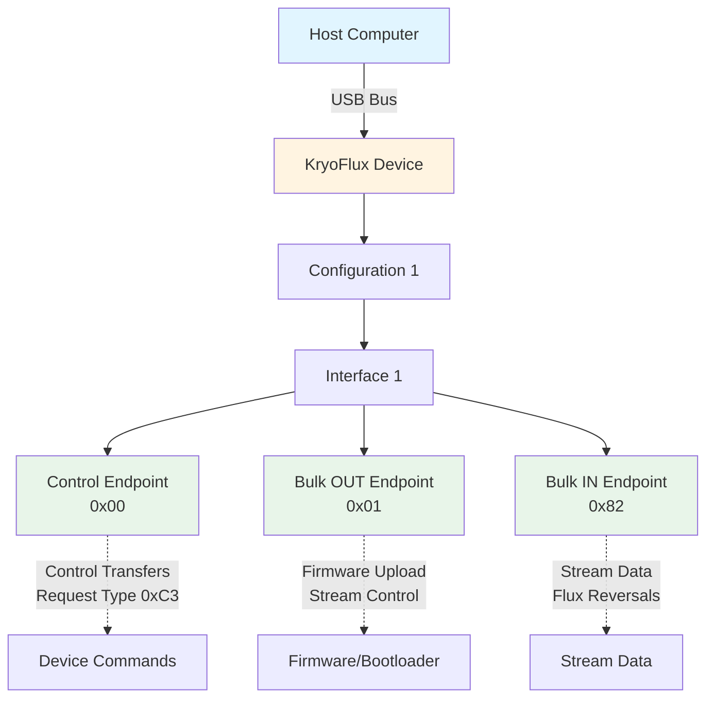
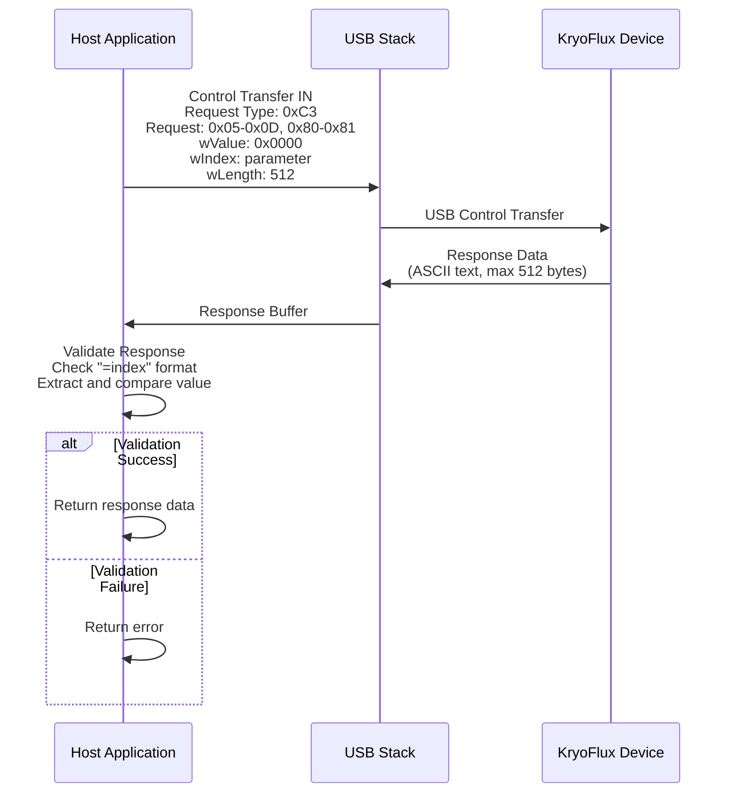
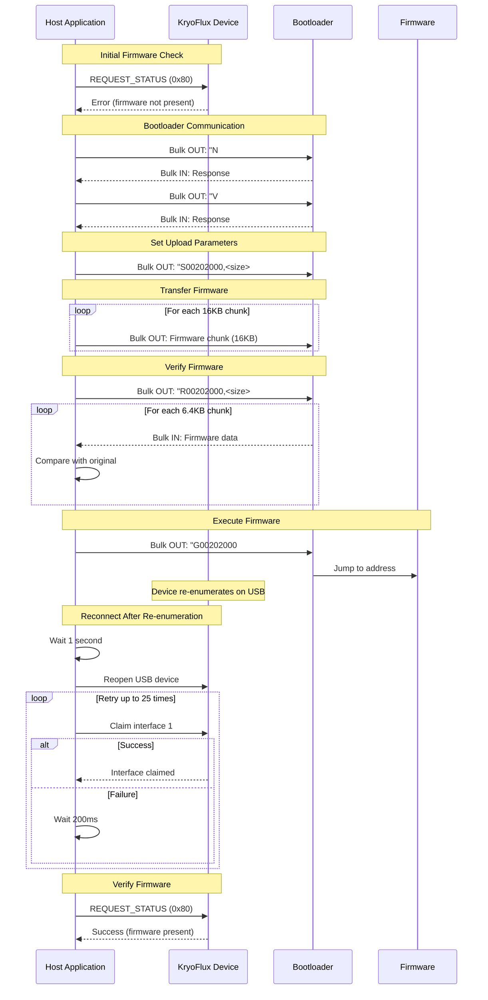
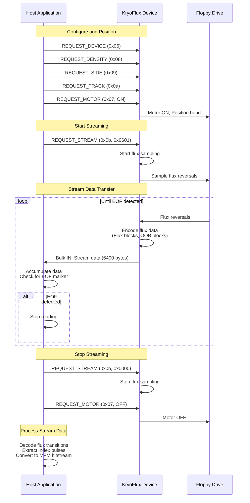

# KryoFlux USB Protocol

**Documentation of the USB communication protocol for KryoFlux devices**

This document describes the USB protocol used to communicate with KryoFlux devices for controlling floppy drives and reading flux data. For information about the stream data format returned by the device, see [KryoFlux_Data_Format.md](KryoFlux_Data_Format.md).

---

## Table of Contents

1. [Introduction](#introduction)
2. [USB Device Identification](#usb-device-identification)
3. [Control Transfers](#control-transfers)
4. [Control Request Codes](#control-request-codes)
5. [Firmware Upload Protocol](#firmware-upload-protocol)
6. [Stream Operations](#stream-operations)
7. [Device Initialization Sequence](#device-initialization-sequence)
8. [Typical Operation Sequence](#typical-operation-sequence)
9. [Error Handling](#error-handling)
10. [Protocol Details](#protocol-details)
11. [Implementation Reference](#implementation-reference)

---

## Introduction

The KryoFlux device communicates with the host computer via USB using a combination of:

- **Control Transfers**: For device configuration and control commands
- **Bulk Transfers**: For firmware upload and stream data transfer

The protocol is designed to be efficient for high-speed flux reversal sampling (up to ~500,000 flux reversals per second for High Density disks).

**Note**: This documentation describes the protocol as implemented in this codebase. The protocol may vary slightly in different KryoFlux firmware versions.

---

## USB Device Identification

### Device Descriptors

| Descriptor | Value | Description |
|------------|-------|-------------|
| **Vendor ID** | `0x03eb` | Atmel (now Microchip) vendor ID |
| **Product ID** | `0x6124` | KryoFlux product ID |
| **Configuration** | `1` | USB configuration number |
| **Interface** | `1` | USB interface number |

### USB Endpoints

| Endpoint | Address | Type | Direction | Description |
|----------|---------|------|-----------|-------------|
| **Bulk OUT** | `0x01` | Bulk | Host → Device | Used for firmware upload and bootloader communication |
| **Bulk IN** | `0x82` | Bulk | Device → Host | Used for stream data transfer and firmware verification |

**Note**: The endpoint addresses are fixed by the KryoFlux hardware design.

### USB Device Topology



---

## Control Transfers

Control transfers are used for all device configuration and control operations.

### Control Transfer Parameters

| Parameter | Value | Description |
|-----------|-------|-------------|
| **Request Type** | `0xc3` | `REQTYPE_IN_VENDOR_OTHER` - Vendor-specific control transfer, device-to-host |
| **Request** | Variable | Request code (see [Control Request Codes](#control-request-codes)) |
| **Value** | `0x0000` | Always zero |
| **Index** | Variable | Parameter value (varies by request) |
| **Length** | `512` | Maximum response buffer size |

### Control Transfer Format

```
USB Control Transfer:
  bmRequestType: 0xc3 (11000011)
    - Bit 7: 1 = Device-to-host (IN)
    - Bits 6-5: 11 = Vendor
    - Bits 4-0: 00011 = Other recipient
  bRequest: Request code (0x05-0x0d, 0x80-0x81)
  wValue: 0x0000
  wIndex: Parameter value (uint16, little-endian)
  wLength: 512 (maximum response size)
```

### Response Format

Control transfers return ASCII text responses. The response format is:

```
<response_text>=<index_value>
```

Where:
- `<response_text>` is an ASCII string (may contain additional information)
- `<index_value>` is the decimal representation of the `wIndex` parameter used in the request

**Response Validation**: The implementation validates that the response contains `=<index_value>` where `index_value` matches the lower 8 bits of the `wIndex` parameter.

**Example Response**:
```
1, name=KryoFlux DiskSystem, version=3.00s
```

For a request with `wIndex = 1`, the response would be validated by extracting the value after `=` and ensuring it matches `1`.

### Control Transfer Flow



---

## Control Request Codes

All control requests use request type `0xc3` (vendor IN) with `wValue = 0x0000`.

### Device Control Requests

#### `0x05` - RESET

**Purpose**: Reset the KryoFlux device.

**Parameters**:
- `wIndex`: `0x0000` (unused)

**Response**: ASCII text confirming reset (format: `0=0`)

**Usage**:
```go
controlIn(0x05, 0, false)
```

**Implementation**: [`kryoflux/kryoflux.go:505`](kryoflux/kryoflux.go)

---

#### `0x06` - DEVICE

**Purpose**: Select the floppy drive device.

**Parameters**:
- `wIndex`: Device number
  - `0` = Drive 0 (Drive A)
  - `1` = Drive 1 (Drive B)

**Response**: ASCII text confirming device selection (format: `<device>=<device>`)

**Usage**:
```go
controlIn(0x06, uint16(device), false)  // device = 0 or 1
```

**Implementation**: [`kryoflux/kryoflux.go:563`](kryoflux/kryoflux.go)

---

#### `0x07` - MOTOR

**Purpose**: Turn the floppy drive motor on or off.

**Parameters**:
- `wIndex`: Motor state
  - `0` = Motor OFF
  - `1` = Motor ON

**Response**: ASCII text confirming motor state (format: `<state>=<state>`)

**Usage**:
```go
controlIn(0x07, 1, false)  // Motor ON
controlIn(0x07, 0, false)  // Motor OFF
```

**Implementation**: [`kryoflux/kryoflux.go:588`, `604`](kryoflux/kryoflux.go)

---

#### `0x08` - DENSITY

**Purpose**: Set the floppy drive density line state.

**Parameters**:
- `wIndex`: Density setting
  - `0` = Low density (DD - Double Density)
  - `1` = High density (HD - High Density)

**Response**: ASCII text confirming density (format: `<density>=<density>`)

**Usage**:
```go
controlIn(0x08, uint16(density), false)  // density = 0 or 1
```

**Implementation**: [`kryoflux/kryoflux.go:568`](kryoflux/kryoflux.go)

---

#### `0x09` - SIDE

**Purpose**: Select the floppy disk side (head).

**Parameters**:
- `wIndex`: Side number
  - `0` = Side 0 (bottom head)
  - `1` = Side 1 (top head)

**Response**: ASCII text confirming side selection (format: `<side>=<side>`)

**Usage**:
```go
controlIn(0x09, uint16(side), false)  // side = 0 or 1
```

**Implementation**: [`kryoflux/kryoflux.go:592`](kryoflux/kryoflux.go)

---

#### `0x0a` - TRACK

**Purpose**: Seek to a specific track (cylinder).

**Parameters**:
- `wIndex`: Track number (0-83 for standard 3.5" floppy)

**Response**: ASCII text confirming track position (format: `<track>=<track>`)

**Usage**:
```go
controlIn(0x0a, uint16(track), false)  // track = 0-83
```

**Implementation**: [`kryoflux/kryoflux.go:596`](kryoflux/kryoflux.go)

---

#### `0x0b` - STREAM

**Purpose**: Start or stop flux data streaming.

**Parameters**:
- `wIndex`: Stream control value
  - `0x0000` = Stop stream
  - `0x0601` = Start stream

**Response**: ASCII text confirming stream state

**Usage**:
```go
controlIn(0x0b, 0x0601, false)  // Start stream
controlIn(0x0b, 0x0000, false)  // Stop stream
```

**Note**: The value `0x0601` is a magic number used by the KryoFlux firmware to start streaming. The exact meaning of this value is firmware-specific.

**Implementation**: [`kryoflux/kryoflux.go:613`, `622`](kryoflux/kryoflux.go)

---

#### `0x0c` - MIN_TRACK

**Purpose**: Set the minimum track number for operations.

**Parameters**:
- `wIndex`: Minimum track number (typically 0)

**Response**: ASCII text confirming minimum track (format: `<track>=<track>`)

**Usage**:
```go
controlIn(0x0c, uint16(minTrack), false)
```

**Implementation**: [`kryoflux/kryoflux.go:573`](kryoflux/kryoflux.go)

---

#### `0x0d` - MAX_TRACK

**Purpose**: Set the maximum track number for operations.

**Parameters**:
- `wIndex`: Maximum track number (typically 83 for 3.5" floppy)

**Response**: ASCII text confirming maximum track (format: `<track>=<track>`)

**Usage**:
```go
controlIn(0x0d, uint16(maxTrack), false)
```

**Implementation**: [`kryoflux/kryoflux.go:578`](kryoflux/kryoflux.go)

---

### Status and Information Requests

#### `0x80` - STATUS

**Purpose**: Query device status to check if firmware is present and device is ready.

**Parameters**:
- `wIndex`: `0x0000` (unused)

**Response**:
- Success: ASCII text (format: `0=0` or similar) - indicates firmware is present
- Failure: USB error - indicates firmware is not present or device error

**Usage**:
```go
controlIn(0x80, 0, true)  // silent mode for status checks
```

**Note**: This request is used during device initialization to determine if firmware needs to be uploaded. The implementation checks this request multiple times to get a stable result.

**Implementation**: [`kryoflux/kryoflux.go:380`](kryoflux/kryoflux.go)

---

#### `0x81` - INFO

**Purpose**: Query device information strings.

**Parameters**:
- `wIndex`: Information index
  - `1` = First information string (device name, version, etc.)
  - `2` = Second information string (additional device info)

**Response**: ASCII text containing device information in key-value format.

**Example Response** (index 1):
```
1, name=KryoFlux DiskSystem, version=3.00s, date=Mar 27 2018, time=18:25:55, hwid=1, hwrv=1, hs=1, sck=24027428.5714285, ick=3003428.5714285625
```

**Usage**:
```go
controlIn(0x81, 1, false)  // Get first info string
controlIn(0x81, 2, false)  // Get second info string
```

**Implementation**: [`kryoflux/kryoflux.go:511`, `518`](kryoflux/kryoflux.go)

---

## Firmware Upload Protocol

If the device does not have firmware loaded (detected by `REQUEST_STATUS` failing), firmware must be uploaded via the bootloader before the device can be used.

### Bootloader Communication

The bootloader communicates via **bulk endpoints** (not control transfers) using ASCII string commands.

**Endpoints**:
- Bulk OUT (`0x01`): Send commands to bootloader
- Bulk IN (`0x82`): Receive responses from bootloader

### Bootloader Commands

#### `N#` - Name Query

**Purpose**: Query bootloader name/identification.

**Request**: Send ASCII string `"N#"` via bulk OUT

**Response**: ASCII string response via bulk IN (terminated by `\r\n` or null)

**Usage**:
```go
bulkOut.Write([]byte("N#"))
response := recvBootloaderString(512)
```

---

#### `V#` - Version Query

**Purpose**: Query bootloader version.

**Request**: Send ASCII string `"V#"` via bulk OUT

**Response**: ASCII string response via bulk IN (terminated by `\r\n` or null)

**Usage**:
```go
bulkOut.Write([]byte("V#"))
response := recvBootloaderString(512)
```

---

#### `S<address>,<size>#` - Set Upload Parameters

**Purpose**: Set the memory address and size for firmware upload.

**Format**: `S` + 8 hex digits (address) + `,` + 8 hex digits (size) + `#`

**Parameters**:
- `<address>`: 32-bit memory address in hexadecimal (e.g., `00202000`)
- `<size>`: 32-bit firmware size in hexadecimal

**Example**:
```
S00202000,00020000#
```

**Usage**:
```go
setCmd := fmt.Sprintf("S%08x,%08x#", 0x00202000, fwSize)
bulkOut.Write([]byte(setCmd))
```

**Constants**:
- Firmware load address: `0x00202000`
- Firmware write chunk size: `16384` bytes
- Firmware read chunk size: `6400` bytes

---

#### Firmware Data Transfer

After sending the Set command, firmware data is transferred via bulk OUT in chunks.

**Process**:
1. Send `S<address>,<size>#` command
2. Transfer firmware data in chunks of 16384 bytes via bulk OUT
3. Continue until all firmware bytes are sent

**Usage**:
```go
for offset := 0; offset < fwSize; offset += 16384 {
    chunkSize := min(16384, fwSize - offset)
    bulkOut.Write(firmwareData[offset:offset+chunkSize])
}
```

---

#### `R<address>,<size>#` - Read/Verify Firmware

**Purpose**: Read back firmware from device memory for verification.

**Format**: `R` + 8 hex digits (address) + `,` + 8 hex digits (size) + `#`

**Process**:
1. Send `R<address>,<size>#` command via bulk OUT
2. Read firmware data back via bulk IN in chunks of 6400 bytes
3. Compare with original firmware data

**Usage**:
```go
readCmd := fmt.Sprintf("R%08x,%08x#", 0x00202000, fwSize)
bulkOut.Write([]byte(readCmd))
// Read back and verify...
```

---

#### `G<address>#` - Execute Firmware

**Purpose**: Jump to and execute firmware at the specified address.

**Format**: `G` + 8 hex digits (address) + `#`

**Example**:
```
G00202000#
```

**Usage**:
```go
goCmd := fmt.Sprintf("G%08x#", 0x00202000)
bulkOut.Write([]byte(goCmd))
```

**Important**: After executing this command, the device will re-enumerate on USB. The host must:
1. Wait for device re-enumeration (typically 1 second)
2. Reopen the USB device
3. Reclaim the interface
4. Verify firmware is present using `REQUEST_STATUS`

---

### Firmware Upload Sequence

The complete firmware upload sequence:

1. **Check firmware presence**: `REQUEST_STATUS` (0x80)
2. **If not present**:
   a. Send `N#` command (query bootloader)
   b. Send `V#` command (query version)
   c. Send `S<address>,<size>#` command (set upload parameters)
   d. Transfer firmware data in chunks via bulk OUT
   e. Send `R<address>,<size>#` command (read back for verification)
   f. Read and verify firmware data via bulk IN
   g. Send `G<address>#` command (execute firmware)
   h. Wait for device re-enumeration (1 second)
   i. Reopen USB device
   j. Reclaim interface (with retries, up to 25 attempts with 200ms delay)
   k. Verify firmware presence with `REQUEST_STATUS`

**Implementation**: [`kryoflux/kryoflux.go:412-500`](kryoflux/kryoflux.go)

### Firmware Upload Sequence Diagram



---

## Stream Operations

Stream operations are used to capture flux reversal data from the floppy disk.

### Starting a Stream

To start streaming flux data:

```go
controlIn(0x0b, 0x0601, false)  // REQUEST_STREAM with value 0x0601
```

**Implementation**: [`kryoflux/kryoflux.go:613`](kryoflux/kryoflux.go)

---

### Reading Stream Data

After starting the stream, data is read continuously via the **bulk IN endpoint** (`0x82`).

**Buffer Size**: 6400 bytes (recommended read buffer size)

**Data Format**: The stream data uses the format described in [KryoFlux_Data_Format.md](KryoFlux_Data_Format.md). The data contains:
- Flux blocks (Flux1, Flux2, Flux3)
- Ovl16 blocks (overflow indicators)
- NOP blocks
- OOB blocks (Index, StreamInfo, StreamEnd, KFInfo, EOF)

**Reading Process**:
1. Continuously read from bulk IN endpoint
2. Accumulate data until EOF marker is detected
3. Process OOB blocks to detect stream end

**EOF Detection**: The stream ends when an OOB block with type `0x0d` (EOF) is encountered. The EOF block structure:
```
0x0D  0x0D  0x0D0D
```

**Timeouts**:
- Maximum total time: 30 seconds
- No data timeout: 5 seconds
- If no data is received within 5 seconds, the stream is considered complete (or failed)

**Implementation**: [`kryoflux/kryoflux.go:838-918`](kryoflux/kryoflux.go)

---

### Stopping a Stream

To stop streaming:

```go
controlIn(0x0b, 0x0000, false)  // REQUEST_STREAM with value 0x0000
```

**Note**: The implementation automatically stops the stream in a defer function if an error occurs during stream capture.

**Implementation**: [`kryoflux/kryoflux.go:622`](kryoflux/kryoflux.go)

### Stream Capture Sequence Diagram



---

## Device Initialization Sequence

The complete device initialization sequence:

1. **Open USB device** by VID/PID (`0x03eb`/`0x6124`)
2. **Get USB configuration 1**
3. **Claim interface 1**
4. **Open bulk endpoints**:
   - Bulk OUT endpoint `0x01`
   - Bulk IN endpoint `0x82`
5. **Check firmware presence**:
   - Send `REQUEST_STATUS` (0x80) multiple times until stable
   - If firmware not present, upload firmware (see [Firmware Upload Protocol](#firmware-upload-protocol))
6. **Reset device**: `REQUEST_RESET` (0x05)
7. **Query device information**:
   - `REQUEST_INFO` (0x81) with index 1
   - `REQUEST_INFO` (0x81) with index 2

**Implementation**: [`kryoflux/kryoflux.go:101-294`](kryoflux/kryoflux.go)

---

## Typical Operation Sequence

A typical sequence for reading a floppy disk track:

1. **Configure device**:
   ```go
   controlIn(0x06, device, false)      // REQUEST_DEVICE
   controlIn(0x08, density, false)     // REQUEST_DENSITY
   controlIn(0x0c, minTrack, false)    // REQUEST_MIN_TRACK
   controlIn(0x0d, maxTrack, false)    // REQUEST_MAX_TRACK
   ```

2. **Position head and start motor**:
   ```go
   controlIn(0x07, 1, false)           // REQUEST_MOTOR (ON)
   controlIn(0x09, side, false)       // REQUEST_SIDE
   controlIn(0x0a, track, false)       // REQUEST_TRACK
   ```

3. **Start stream**:
   ```go
   controlIn(0x0b, 0x0601, false)     // REQUEST_STREAM (START)
   ```

4. **Read stream data**:
   - Continuously read from bulk IN endpoint
   - Accumulate data until EOF marker detected
   - Process OOB blocks for index pulses and stream end

5. **Stop stream**:
   ```go
   controlIn(0x0b, 0x0000, false)     // REQUEST_STREAM (STOP)
   ```

6. **Turn off motor**:
   ```go
   controlIn(0x07, 0, false)         // REQUEST_MOTOR (OFF)
   ```

**Implementation**: [`kryoflux/kryoflux.go:1171-1278`](kryoflux/kryoflux.go)

---

## Error Handling

### Control Transfer Failures

Control transfers may fail for various reasons:
- Device not responding
- USB communication errors
- Invalid request parameters

**Handling**: The implementation validates responses and returns errors if:
- USB control transfer fails
- Response format is invalid
- Response value doesn't match expected index

**Implementation**: [`kryoflux/kryoflux.go:297-346`](kryoflux/kryoflux.go)

---

### Firmware Upload Failures

Firmware upload may fail at several stages:
- Bootloader communication failure
- Firmware transfer failure
- Firmware verification failure
- Device re-enumeration failure

**Handling**:
- Each stage returns an error if it fails
- Firmware verification compares byte-by-byte with original
- Interface claiming after re-enumeration uses retries (up to 25 attempts with 200ms delay)

**Implementation**: [`kryoflux/kryoflux.go:412-500`, `224-242`](kryoflux/kryoflux.go)

---

### Stream Read Timeouts

Stream reading may timeout if:
- No data is received for 5 seconds
- Total stream time exceeds 30 seconds
- Device stops sending data unexpectedly

**Handling**:
- If partial data received, return it (may be valid partial stream)
- If no data received at all, return error
- EOF detection stops reading immediately when encountered

**Implementation**: [`kryoflux/kryoflux.go:838-918`](kryoflux/kryoflux.go)

---

### Device Re-enumeration Issues

After firmware upload, the device re-enumerates. Issues may occur:
- Device not appearing after re-enumeration
- Interface not available immediately
- Device enumeration timeout

**Handling**:
- Wait 1 second after firmware execution
- Retry interface claiming up to 25 times with 200ms delay between attempts
- Verify firmware presence after re-enumeration

**Implementation**: [`kryoflux/kryoflux.go:192-242`](kryoflux/kryoflux.go)

---

## Protocol Details

### Byte Ordering

- **Multi-byte values in control transfers**: Little-endian (least significant byte first)
- **Stream data**: As specified in [KryoFlux_Data_Format.md](KryoFlux_Data_Format.md) (little-endian for OOB blocks)

### Response Validation

Control transfer responses are validated by:
1. Checking for `=` character in response
2. Extracting numeric value after `=`
3. Comparing with lower 8 bits of `wIndex` parameter
4. If validation fails and not in silent mode, return error

**Implementation**: [`kryoflux/kryoflux.go:320-340`](kryoflux/kryoflux.go)

### Timeout Values

| Operation | Timeout | Description |
|-----------|---------|-------------|
| Control transfers | 5 seconds | OS-level USB control transfer timeout |
| Bulk transfers | OS default | OS-level USB bulk transfer timeout |
| Stream read (total) | 30 seconds | Maximum time for complete stream capture |
| Stream read (no data) | 5 seconds | Timeout if no data received |
| Interface retry delay | 200ms | Delay between interface claim retries |
| Device re-enumeration wait | 1 second | Wait time after firmware execution |

### Buffer Sizes

| Buffer Type | Size | Description |
|-------------|------|-------------|
| Control transfer response | 512 bytes | Maximum response buffer |
| Stream read buffer | 6400 bytes | Recommended bulk IN read buffer |
| Firmware write chunk | 16384 bytes | Chunk size for firmware upload |
| Firmware read chunk | 6400 bytes | Chunk size for firmware verification |
| Bootloader string buffer | 512 bytes | Maximum bootloader response size |

---

## Implementation Reference

### Key Files

- **Main Implementation**: [`kryoflux/kryoflux.go`](kryoflux/kryoflux.go)
- **Stream Data Format**: [`docs/KryoFlux_Data_Format.md`](KryoFlux_Data_Format.md)

### Key Functions

| Function | Purpose | Location |
|----------|---------|----------|
| `NewClient()` | Initialize and connect to KryoFlux device | `kryoflux/kryoflux.go:101` |
| `controlIn()` | Perform control transfer IN request | `kryoflux/kryoflux.go:297` |
| `uploadFirmware()` | Upload firmware via bootloader | `kryoflux/kryoflux.go:412` |
| `reset()` | Reset device and query info | `kryoflux/kryoflux.go:502` |
| `configure()` | Configure device parameters | `kryoflux/kryoflux.go:561` |
| `motorOn()` / `motorOff()` | Control floppy motor | `kryoflux/kryoflux.go:586`, `603` |
| `streamOn()` / `streamOff()` | Control stream | `kryoflux/kryoflux.go:612`, `621` |
| `captureStream()` | Capture flux data stream | `kryoflux/kryoflux.go:838` |

### Constants

All protocol constants are defined in [`kryoflux/kryoflux.go:23-61`](kryoflux/kryoflux.go):

```go
const (
    VendorID  = 0x03eb
    ProductID = 0x6124
    Interface = 1

    EndpointBulkOut = 0x01
    EndpointBulkIn  = 0x82

    ControlRequestType = 0xc3

    RequestReset    = 0x05
    RequestDevice   = 0x06
    RequestMotor    = 0x07
    RequestDensity  = 0x08
    RequestSide     = 0x09
    RequestTrack    = 0x0a
    RequestStream   = 0x0b
    RequestMinTrack = 0x0c
    RequestMaxTrack = 0x0d
    RequestStatus   = 0x80
    RequestInfo     = 0x81

    FWLoadAddress    = 0x00202000
    FWWriteChunkSize = 16384
    FWReadChunkSize  = 6400

    ReadBufferSize = 6400
    StreamOnValue  = 0x601
)
```

---

## References

- **KryoFlux Stream Data Format**: [KryoFlux_Data_Format.md](KryoFlux_Data_Format.md)
- **Implementation**: [`kryoflux/kryoflux.go`](kryoflux/kryoflux.go)
- **KryoFlux Official Documentation**: [Software Preservation Society](https://www.softpres.org/)
