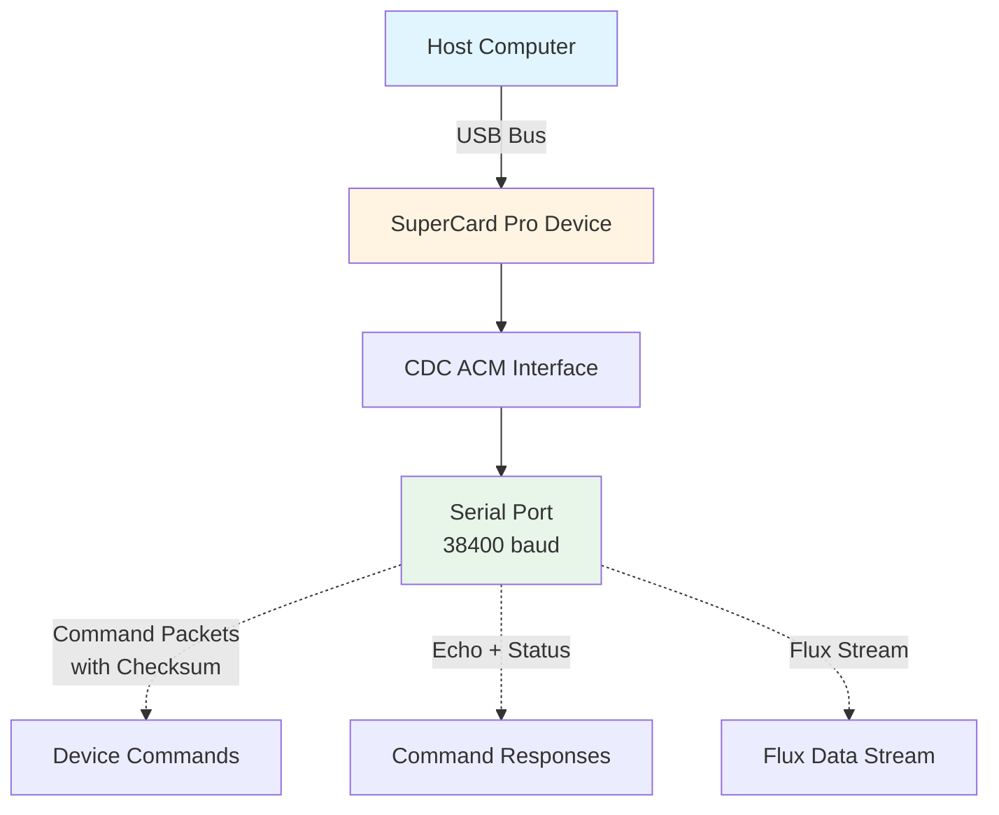
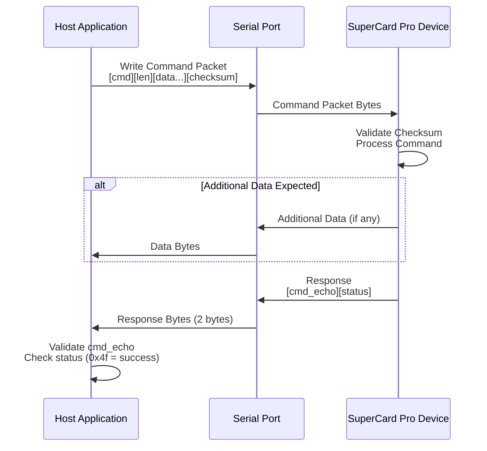
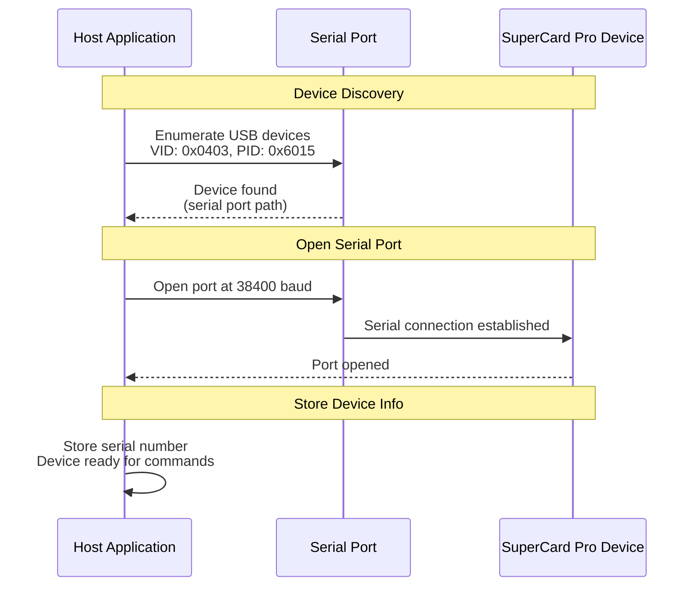
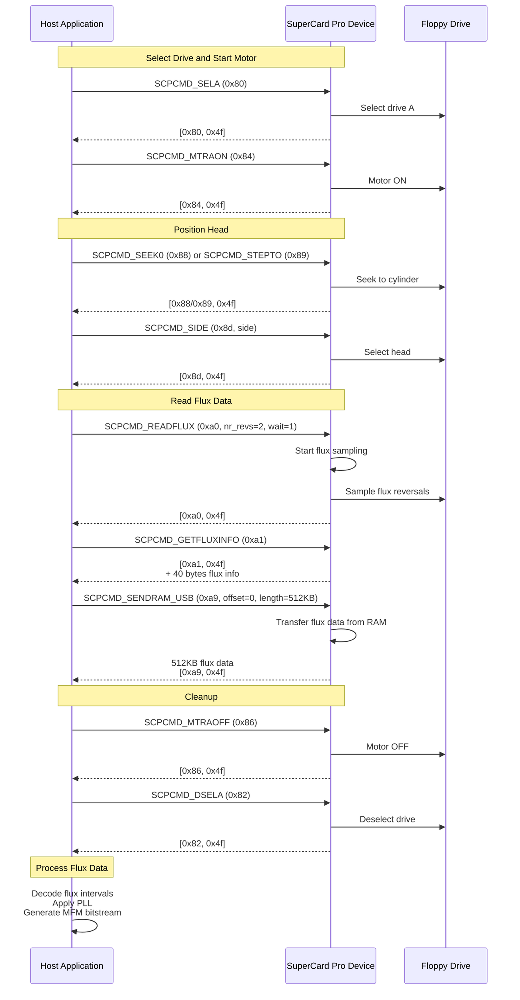

# SuperCard Pro USB Protocol

**Documentation of the USB/serial communication protocol for SuperCard Pro devices**

This document describes the USB/serial communication protocol used to communicate with SuperCard Pro devices for controlling floppy drives and reading flux data. The SuperCard Pro device uses CDC ACM (USB Serial) communication over a serial port interface.

---

## Table of Contents

1. [Introduction](#introduction)
2. [USB Device Identification](#usb-device-identification)
3. [Serial Communication Protocol](#serial-communication-protocol)
4. [Command Packet Format](#command-packet-format)
5. [Checksum Calculation](#checksum-calculation)
6. [Response Format](#response-format)
7. [Command Set](#command-set)
8. [Flux Data Format](#flux-data-format)
9. [Flux Info Structure](#flux-info-structure)
10. [Device Initialization Sequence](#device-initialization-sequence)
11. [Typical Operation Sequence](#typical-operation-sequence)
12. [Error Handling](#error-handling)
13. [Protocol Details](#protocol-details)
14. [Implementation Reference](#implementation-reference)

---

## Introduction

The SuperCard Pro device communicates with the host computer via USB using **CDC ACM (USB Serial)** protocol:

- **Serial Port Communication**: All commands and data are sent over a serial port interface
- **Baud Rate**: 38400 baud for all operations
- **Command-Response Model**: Commands are sent as packets with checksum, and responses include echo and status bytes
- **Big-Endian Data**: Multi-byte values in commands and responses use big-endian byte ordering

The protocol is designed to be efficient for high-speed flux reversal sampling and real-time floppy drive control.

**Note**: This documentation describes the protocol as implemented in this codebase. The protocol may vary slightly in different SuperCard Pro firmware versions.

---

## USB Device Identification

### Device Descriptors

| Descriptor | Value | Description |
|------------|-------|-------------|
| **Vendor ID** | `0x0403` | FTDI vendor ID |
| **Product ID** | `0x6015` | SuperCard Pro product ID |
| **Interface Type** | CDC ACM | USB Communication Device Class - Abstract Control Model (Serial) |

### Serial Port Communication

The SuperCard Pro device appears as a USB serial port (CDC ACM device) on the host system. The device is identified by:

- **Vendor ID**: `0x0403` (FTDI)
- **Product ID**: `0x6015`
- **Serial Number**: Unique serial number string (used for device identification)

The device is accessed via a serial port interface using standard serial port libraries (e.g., `go.bug.st/serial` in Go).

### USB Device Topology



---

## Serial Communication Protocol

### Baud Rate Configuration

| Mode | Baud Rate | Description |
|------|-----------|-------------|
| **Normal Operation** | `38400` | Standard communication speed for all commands |

### Command Packet Format

All commands are sent as packets with the following format:

```
[cmd byte][len byte][data...][checksum byte]
```

Where:
- **cmd byte** (1 byte): The command opcode (0x80-0xd0)
- **len byte** (1 byte): Number of data bytes (0-255)
- **data** (variable): Command-specific parameters (0-255 bytes)
- **checksum** (1 byte): Checksum byte (see [Checksum Calculation](#checksum-calculation))

**Packet Size**: Minimum 3 bytes (cmd, len, checksum), maximum 258 bytes (cmd, len, 255 data bytes, checksum)

**Example Packet** (SCPCMD_STEPTO with cylinder 42):
```go
packet := []byte{0x89, 0x01, 0x2a, 0xf4}  // [SCPCMD_STEPTO, len=1, cylinder=42, checksum]
```

### Response Format

After sending a command, the device responds with:

```
[cmd_echo][status]
```

Where:
- **cmd_echo** (1 byte): Echo of the command code that was sent
- **status** (1 byte): Status/error code (0x4f = success, other values = error)

**Response Validation**: The implementation validates that `cmd_echo` matches the sent command code. If it doesn't match, the response is considered invalid.

### Additional Response Data

Some commands return additional data after the 2-byte response:

- **SCPCMD_SCPINFO**: Returns 2 bytes (hardware version, firmware version) after ACK response
- **SCPCMD_GETFLUXINFO**: Returns 40 bytes (flux info for 5 revolutions) after ACK response
- **SCPCMD_SENDRAM_USB**: Reads data (typically 512KB) before reading the 2-byte response

### Command Execution Model

Commands cannot be pipelined. The host must:
1. Send a command packet
2. Wait for and read the 2-byte response (cmd_echo, status)
3. If applicable, read any additional response data
4. Validate the response
5. Only then send the next command

Attempting to send a new command before the previous command completes will result in communication errors.

### Command Flow Diagram



---

## Command Packet Format

### Packet Structure

Every command packet has the following structure:

| Offset | Size | Field | Description |
|--------|------|-------|-------------|
| 0 | 1 | `cmd` | Command opcode |
| 1 | 1 | `len` | Number of data bytes (0-255) |
| 2 | `len` | `data` | Command-specific data (variable length) |
| 2+`len` | 1 | `checksum` | Checksum byte |

### Packet Building Algorithm

```go
packet := make([]byte, 3+dataLen)
packet[0] = cmd
packet[1] = byte(dataLen)
if dataLen > 0 {
    copy(packet[2:2+dataLen], data)
}
checksum := byte(0x4a)
for i := 0; i < 2+dataLen; i++ {
    checksum += packet[i]
}
packet[2+dataLen] = checksum
```

---

## Checksum Calculation

The checksum is calculated as:

```
checksum = 0x4a + sum(cmd, len, data[0], data[1], ..., data[len-1])
```

Where:
- `0x4a` is a magic constant (74 decimal)
- The sum includes the command byte, length byte, and all data bytes
- The checksum is a single byte (wraps around if sum exceeds 255)

**Example**: Command `SCPCMD_STEPTO` (0x89) with cylinder 42 (0x2a):
- cmd = 0x89
- len = 0x01
- data[0] = 0x2a
- sum = 0x4a + 0x89 + 0x01 + 0x2a = 0x4a + 0xb4 = 0xfe
- checksum = 0xfe
- Packet: `[0x89, 0x01, 0x2a, 0xfe]`

**Implementation**: [`supercardpro/supercardpro.go:109-114`](supercardpro/supercardpro.go)

---

## Response Format

### Standard Response

All commands return a 2-byte response:

| Offset | Size | Field | Description |
|--------|------|-------|-------------|
| 0 | 1 | `cmd_echo` | Echo of the command code sent |
| 1 | 1 | `status` | Status code (0x4f = success) |

### Status Codes

| Code | Constant | Description |
|------|----------|-------------|
| `0x4f` | `SCP_STATUS_OK` | Command completed successfully |
| Other | - | Error code (specific meanings not documented in current implementation) |

**Response Validation**: The implementation validates that `cmd_echo` matches the sent command code and that `status == SCP_STATUS_OK`.

**Implementation**: [`supercardpro/supercardpro.go:130-147`](supercardpro/supercardpro.go)

---

## Command Set

All commands use the packet format `[cmd][len][data...][checksum]` and return `[cmd_echo][status]` as response.

### Drive Selection Commands

#### `SCPCMD_SELA` (0x80) - Select Drive A

**Purpose**: Select drive A (drive 0).

**Command Format**:
```
[SCPCMD_SELA, 0, checksum]
```

**Parameters**: None (len = 0)

**Response**: Standard 2-byte response

**Usage**:
```go
c.scpSend(SCPCMD_SELA, nil, nil)
```

**Implementation**: [`supercardpro/supercardpro.go:184-207`](supercardpro/supercardpro.go)

---

#### `SCPCMD_SELB` (0x81) - Select Drive B

**Purpose**: Select drive B (drive 1).

**Command Format**:
```
[SCPCMD_SELB, 0, checksum]
```

**Parameters**: None (len = 0)

**Response**: Standard 2-byte response

**Usage**:
```go
c.scpSend(SCPCMD_SELB, nil, nil)
```

**Implementation**: [`supercardpro/supercardpro.go:184-207`](supercardpro/supercardpro.go)

---

#### `SCPCMD_DSELA` (0x82) - Deselect Drive A

**Purpose**: Deselect drive A (drive 0).

**Command Format**:
```
[SCPCMD_DSELA, 0, checksum]
```

**Parameters**: None (len = 0)

**Response**: Standard 2-byte response

**Usage**:
```go
c.scpSend(SCPCMD_DSELA, nil, nil)
```

**Implementation**: [`supercardpro/supercardpro.go:209-232`](supercardpro/supercardpro.go)

---

#### `SCPCMD_DSELB` (0x83) - Deselect Drive B

**Purpose**: Deselect drive B (drive 1).

**Command Format**:
```
[SCPCMD_DSELB, 0, checksum]
```

**Parameters**: None (len = 0)

**Response**: Standard 2-byte response

**Usage**:
```go
c.scpSend(SCPCMD_DSELB, nil, nil)
```

**Implementation**: [`supercardpro/supercardpro.go:209-232`](supercardpro/supercardpro.go)

---

### Motor Control Commands

#### `SCPCMD_MTRAON` (0x84) - Turn Motor A On

**Purpose**: Turn on the motor for drive A (drive 0).

**Command Format**:
```
[SCPCMD_MTRAON, 0, checksum]
```

**Parameters**: None (len = 0)

**Response**: Standard 2-byte response

**Usage**:
```go
c.scpSend(SCPCMD_MTRAON, nil, nil)
```

**Implementation**: [`supercardpro/supercardpro.go:184-207`](supercardpro/supercardpro.go)

---

#### `SCPCMD_MTRBON` (0x85) - Turn Motor B On

**Purpose**: Turn on the motor for drive B (drive 1).

**Command Format**:
```
[SCPCMD_MTRBON, 0, checksum]
```

**Parameters**: None (len = 0)

**Response**: Standard 2-byte response

**Usage**:
```go
c.scpSend(SCPCMD_MTRBON, nil, nil)
```

**Implementation**: [`supercardpro/supercardpro.go:184-207`](supercardpro/supercardpro.go)

---

#### `SCPCMD_MTRAOFF` (0x86) - Turn Motor A Off

**Purpose**: Turn off the motor for drive A (drive 0).

**Command Format**:
```
[SCPCMD_MTRAOFF, 0, checksum]
```

**Parameters**: None (len = 0)

**Response**: Standard 2-byte response

**Usage**:
```go
c.scpSend(SCPCMD_MTRAOFF, nil, nil)
```

**Implementation**: [`supercardpro/supercardpro.go:209-232`](supercardpro/supercardpro.go)

---

#### `SCPCMD_MTRBOFF` (0x87) - Turn Motor B Off

**Purpose**: Turn off the motor for drive B (drive 1).

**Command Format**:
```
[SCPCMD_MTRBOFF, 0, checksum]
```

**Parameters**: None (len = 0)

**Response**: Standard 2-byte response

**Usage**:
```go
c.scpSend(SCPCMD_MTRBOFF, nil, nil)
```

**Implementation**: [`supercardpro/supercardpro.go:209-232`](supercardpro/supercardpro.go)

---

### Head Positioning Commands

#### `SCPCMD_SEEK0` (0x88) - Seek Track 0

**Purpose**: Seek to track 0 (home position).

**Command Format**:
```
[SCPCMD_SEEK0, 0, checksum]
```

**Parameters**: None (len = 0)

**Response**: Standard 2-byte response

**Usage**:
```go
c.scpSend(SCPCMD_SEEK0, nil, nil)
```

**Implementation**: [`supercardpro/supercardpro.go:234-265`](supercardpro/supercardpro.go)

---

#### `SCPCMD_STEPTO` (0x89) - Step to Specified Track

**Purpose**: Step the head to the specified cylinder (track).

**Command Format**:
```
[SCPCMD_STEPTO, 1, cylinder, checksum]
```

**Parameters**:
- `cylinder` (1 byte): Cylinder number (0-83 for standard 3.5" floppy)

**Response**: Standard 2-byte response

**Usage**:
```go
cylByte := byte(cyl)
c.scpSend(SCPCMD_STEPTO, []byte{cylByte}, nil)
```

**Note**: After stepping, the implementation applies a seek settle delay (20ms).

**Implementation**: [`supercardpro/supercardpro.go:234-265`](supercardpro/supercardpro.go)

---

#### `SCPCMD_SIDE` (0x8d) - Select Side

**Purpose**: Select the floppy disk side (head).

**Command Format**:
```
[SCPCMD_SIDE, 1, side, checksum]
```

**Parameters**:
- `side` (1 byte): Side number
  - `0` = Bottom head (side 0)
  - `1` = Top head (side 1)

**Response**: Standard 2-byte response

**Usage**:
```go
sideByte := byte(side)
c.scpSend(SCPCMD_SIDE, []byte{sideByte}, nil)
```

**Implementation**: [`supercardpro/supercardpro.go:234-265`](supercardpro/supercardpro.go)

---

### Parameter Commands

#### `SCPCMD_SETPARAMS` (0x91) - Set Parameters

**Purpose**: Set device parameters.

**Command Format**:
```
[SCPCMD_SETPARAMS, len, params..., checksum]
```

**Parameters**:
- `params` (variable): Parameter data (format not used in current implementation)

**Response**: Standard 2-byte response

**Note**: Not implemented in current codebase.

---

### Flux Operation Commands

#### `SCPCMD_READFLUX` (0xa0) - Read Flux

**Purpose**: Read raw flux data from the current track.

**Command Format**:
```
[SCPCMD_READFLUX, 2, nr_revs, wait_index, checksum]
```

**Parameters**:
- `nr_revs` (1 byte): Number of revolutions to read (typically 2)
- `wait_index` (1 byte): If non-zero, wait for index pulse before starting (typically 1)

**Response**: Standard 2-byte response

**Usage**:
```go
info := []byte{byte(nrRevs), 1}  // [nr_revs, wait_index=1]
c.scpSend(SCPCMD_READFLUX, info, nil)
```

**Note**: After sending this command, call `SCPCMD_GETFLUXINFO` to retrieve flux information, then `SCPCMD_SENDRAM_USB` to retrieve the flux data.

**Implementation**: [`supercardpro/supercardpro.go:267-313`](supercardpro/supercardpro.go)

---

#### `SCPCMD_GETFLUXINFO` (0xa1) - Get Flux Info

**Purpose**: Get information about the last flux read operation.

**Command Format**:
```
[SCPCMD_GETFLUXINFO, 0, checksum]
```

**Parameters**: None (len = 0)

**Response**:
- Standard 2-byte response (cmd_echo, status)
- Additional data: 40 bytes (flux info for up to 5 revolutions)

**Additional Data Format** (40 bytes, big-endian):
- 5 revolutions × 8 bytes each:
  - Bytes 0-3: `IndexTime` (uint32, big-endian) - Duration of revolution in 25ns units
  - Bytes 4-7: `NrBitcells` (uint32, big-endian) - Number of bitcells

**Usage**:
```go
c.scpSend(SCPCMD_GETFLUXINFO, nil, nil)
// Then read 40 bytes
infoData := make([]byte, 40)
io.ReadFull(c.port, infoData)
```

**Implementation**: [`supercardpro/supercardpro.go:267-313`](supercardpro/supercardpro.go)

---

#### `SCPCMD_SENDRAM_USB` (0xa9) - Send RAM Data to USB

**Purpose**: Transfer flux data from device RAM buffer to USB (host).

**Command Format**:
```
[SCPCMD_SENDRAM_USB, 8, offset[be32], length[be32], checksum]
```

**Parameters** (8 bytes, big-endian):
- `offset` (uint32, big-endian): Starting offset in RAM buffer (typically 0)
- `length` (uint32, big-endian): Number of bytes to transfer (typically 512*1024 = 524288)

**Response**:
- Data transfer: `length` bytes of flux data (read before response)
- Standard 2-byte response (cmd_echo, status) after data transfer

**Special Handling**: This command reads data before reading the response. The data is read first, then the 2-byte response.

**Usage**:
```go
ramCmd := make([]byte, 8)
binary.BigEndian.PutUint32(ramCmd[0:4], 0)        // offset
binary.BigEndian.PutUint32(ramCmd[4:8], 512*1024) // length
fluxData := make([]byte, 512*1024)
c.scpSend(SCPCMD_SENDRAM_USB, ramCmd, fluxData)  // fluxData is filled before response
```

**Implementation**: [`supercardpro/supercardpro.go:95-148`, `267-313`](supercardpro/supercardpro.go)

---

### Device Information Commands

#### `SCPCMD_SCPINFO` (0xd0) - Get SCP Info

**Purpose**: Get hardware and firmware version information.

**Command Format**:
```
[SCPCMD_SCPINFO, 0, checksum]
```

**Parameters**: None (len = 0)

**Response**:
- Standard 2-byte response (cmd_echo, status)
- Additional data: 2 bytes (version information)

**Additional Data Format** (2 bytes):
- Byte 0: Hardware version
  - Upper nibble (bits 7-4): Major version
  - Lower nibble (bits 3-0): Minor version
- Byte 1: Firmware version
  - Upper nibble (bits 7-4): Major version
  - Lower nibble (bits 3-0): Minor version

**Usage**:
```go
c.scpSend(SCPCMD_SCPINFO, nil, nil)
// Then read 2 bytes
response := make([]byte, 2)
io.ReadFull(c.port, response)
hwMajor := response[0] >> 4
hwMinor := response[0] & 0x0f
fwMajor := response[1] >> 4
fwMinor := response[1] & 0x0f
```

**Implementation**: [`supercardpro/supercardpro.go:158-182`](supercardpro/supercardpro.go)

---

## Flux Data Format

The flux data returned by `SCPCMD_SENDRAM_USB` uses a format optimized for flux transition intervals.

### Stream Structure

The flux data consists of:
1. **16-bit intervals**: 16-bit big-endian unsigned integers representing time intervals
2. **Overflow handling**: Value `0x0000` represents overflow (add 0x10000 to accumulated time)
3. **Time units**: Each interval unit represents 25 nanoseconds
4. **Buffer size**: Maximum 512KB (524288 bytes = 262144 intervals)

### Interval Encoding

Flux intervals are encoded as 16-bit big-endian unsigned integers:

```
[high_byte, low_byte]  // 16-bit big-endian
```

Where the interval value represents time in units of 25 nanoseconds.

**Example**: Interval value `0x05DC` (1500 decimal)
- Represents: 1500 × 25ns = 37500ns = 37.5 microseconds until next flux transition

### Overflow Handling

When the interval value is `0x0000`, it represents an overflow:
- Add `0x10000` (65536) × 25ns = 1638400ns = 1.6384ms to the accumulated time
- Continue reading the next interval value

**Overflow Example**:
```
Intervals: [0x0000, 0x05DC]
Processing:
  1. 0x0000 → overflow, add 0x10000 × 25ns = 1638400ns
  2. 0x05DC → add 1500 × 25ns = 37500ns
  Total time: 1638400ns + 37500ns = 1675900ns
```

### Flux Decoding Algorithm

The flux data is decoded as follows:

1. **Initialize**: Set `fluxIntervalNs = 0` (accumulated time in nanoseconds)
2. **For each 16-bit value in stream** (big-endian):
   - Read 2 bytes as big-endian uint16
   - If value == `0x0000`: Overflow
     - Add `0x10000 × 25ns` to `fluxIntervalNs`
     - Continue to next interval
   - Else: Normal interval
     - Add `value × 25ns` to `fluxIntervalNs`
     - Record flux transition at `fluxIntervalNs`
3. **Stop**: When accumulated time exceeds one revolution (IndexTime)

**Implementation**: [`supercardpro/supercardpro.go:402-427`](supercardpro/supercardpro.go)

### Flux Data Limits

- **Maximum buffer size**: 512KB (524288 bytes)
- **Maximum intervals**: 262144 (512KB / 2 bytes per interval)
- **Maximum time per interval**: 65535 × 25ns = 1.638375ms (without overflow)
- **With overflow**: Unlimited time range (through overflow mechanism)

---

## Flux Info Structure

The flux info structure is returned by `SCPCMD_GETFLUXINFO` and contains information for up to 5 revolutions.

### Structure Format

**Total Size**: 40 bytes (5 revolutions × 8 bytes each)

**Revolution Structure** (8 bytes, big-endian):

| Offset | Size | Field | Type | Description |
|--------|------|-------|------|-------------|
| 0-3 | 4 | `IndexTime` | uint32 | Duration of revolution in 25ns units (big-endian) |
| 4-7 | 4 | `NrBitcells` | uint32 | Number of bitcells/transitions (big-endian) |

**Complete Structure** (40 bytes):
- Revolution 0: Bytes 0-7
- Revolution 1: Bytes 8-15
- Revolution 2: Bytes 16-23
- Revolution 3: Bytes 24-31
- Revolution 4: Bytes 32-39

### Field Descriptions

#### `IndexTime`

- **Type**: uint32 (big-endian)
- **Units**: 25 nanoseconds per unit
- **Description**: The duration of one complete revolution (from index pulse to index pulse)
- **Conversion**: `duration_ns = IndexTime × 25`
- **RPM Calculation**: `RPM = 60 × 1e9 / (IndexTime × 25)`

**Example**: IndexTime = 8000000
- Duration: 8000000 × 25ns = 200000000ns = 0.2 seconds
- RPM: 60 / 0.2 = 300 RPM

#### `NrBitcells`

- **Type**: uint32 (big-endian)
- **Description**: Number of bitcells (flux transitions) detected during the revolution
- **Usage**: Used to calculate bit rate and verify data integrity

### Parsing Example

```go
infoData := make([]byte, 40)
io.ReadFull(c.port, infoData)

var fluxInfo [5]FluxInfo
for i := 0; i < 5; i++ {
    offset := i * 8
    fluxInfo[i].IndexTime = binary.BigEndian.Uint32(infoData[offset : offset+4])
    fluxInfo[i].NrBitcells = binary.BigEndian.Uint32(infoData[offset+4 : offset+8])
}
```

**Implementation**: [`supercardpro/supercardpro.go:289-295`](supercardpro/supercardpro.go)

---

## Device Initialization Sequence

The complete device initialization sequence:

1. **Enumerate USB devices** by VID/PID (`0x0403`/`0x6015`)
2. **Open serial port** at 38400 baud
3. **Store serial number** for device identification

**Initialization Sequence Diagram**:



**Implementation**: [`supercardpro/supercardpro.go:66-87`](supercardpro/supercardpro.go)

---

## Typical Operation Sequence

A typical sequence for reading a floppy disk track:

1. **Select drive and start motor**:
   ```go
   c.selectDrive(0)  // Select drive 0, turn on motor
   ```

2. **Seek to track and select side**:
   ```go
   c.seekTrack(track)  // Seek to cylinder, select side
   ```

3. **Read flux data**:
   ```go
   fluxData, err := c.readFlux(2)  // Read 2 revolutions
   ```

4. **Decode flux data**:
   - Parse flux intervals from 16-bit big-endian data
   - Apply PLL to recover clock and generate bitcells
   - Convert to MFM bitstream

5. **Deselect drive**:
   ```go
   c.deselectDrive(0)  // Turn off motor, deselect drive
   ```

**Operation Sequence Diagram**:



**Implementation**: [`supercardpro/supercardpro.go:514-599`](supercardpro/supercardpro.go)

---

## Error Handling

### Status Code Errors

All commands return a status byte in the response. The implementation checks for:

- **Status 0x4f**: Success (`SCP_STATUS_OK`)
- **Other status values**: Error (returns error with status code)

**Error Handling**:
```go
if response[1] != SCP_STATUS_OK {
    return fmt.Errorf("command failed with status 0x%02x", response[1])
}
```

**Implementation**: [`supercardpro/supercardpro.go:142-145`](supercardpro/supercardpro.go)

---

### Command Echo Mismatch

The implementation validates that the command echo matches the sent command:

```go
if response[0] != cmd {
    return fmt.Errorf("command echo mismatch: sent 0x%02x, received 0x%02x", cmd, response[0])
}
```

This indicates a communication error or protocol mismatch.

**Implementation**: [`supercardpro/supercardpro.go:137-140`](supercardpro/supercardpro.go)

---

### Serial Communication Errors

Serial port communication may fail for various reasons:
- Port not available
- Device disconnected
- Communication timeout
- Invalid packet format
- Checksum mismatch

**Handling**: The implementation validates:
- Command packet format (checksum)
- Command echo matches sent command
- Status codes
- Response data length and format

**Implementation**: [`supercardpro/supercardpro.go:95-148`](supercardpro/supercardpro.go)

---

### Flux Data Decoding Errors

Flux data decoding may fail if:
- Empty flux data buffer
- Invalid flux info (IndexTime == 0)
- No flux transitions found
- No bitcells generated

**Handling**: The implementation validates flux data and returns descriptive errors.

**Implementation**: [`supercardpro/supercardpro.go:384-497`](supercardpro/supercardpro.go)

---

## Protocol Details

### Byte Ordering

- **Multi-byte values in commands**: Big-endian (most significant byte first)
- **Multi-byte values in responses**: Big-endian
- **Flux data intervals**: Big-endian (16-bit)
- **Flux info structure**: Big-endian (32-bit values)

**Examples**:
- `uint32` value 0x12345678 encoded as: `[0x12, 0x34, 0x56, 0x78]`
- `uint16` value 0x1234 encoded as: `[0x12, 0x34]`

**Implementation**: [`supercardpro/supercardpro.go:289-295`, `297-301`, `402-427`](supercardpro/supercardpro.go)

---

### Checksum Validation

The device validates the checksum before processing the command. If the checksum is invalid, the command is rejected (typically returns error status).

**Checksum Algorithm**: `checksum = 0x4a + sum(cmd, len, data...)`

**Implementation**: [`supercardpro/supercardpro.go:109-114`](supercardpro/supercardpro.go)

---

### Timeout Values

| Operation | Timeout | Description |
|-----------|---------|-------------|
| Serial port read | OS default | OS-level serial port read timeout |
| Serial port write | OS default | OS-level serial port write timeout |
| Seek settle delay | 20ms | Delay after seeking to a track |

---

### Buffer Sizes

| Buffer Type | Size | Description |
|-------------|------|-------------|
| Command packet (minimum) | 3 bytes | cmd + len + checksum |
| Command packet (maximum) | 258 bytes | cmd + len + 255 data + checksum |
| Command response | 2 bytes | cmd_echo + status |
| SCPINFO response | 2 bytes | Additional version data |
| Flux info response | 40 bytes | 5 revolutions × 8 bytes |
| Flux data buffer | 512KB | Maximum flux data buffer (262144 intervals) |

---

### Time Units and Conversions

| Value | Units | Conversion |
|-------|-------|------------|
| Flux intervals | 25ns units | `time_ns = interval × 25` |
| IndexTime | 25ns units | `duration_ns = IndexTime × 25` |
| RPM calculation | - | `RPM = 60 × 1e9 / (IndexTime × 25)` |

**Example**: IndexTime = 8000000
- Duration: 8000000 × 25ns = 200ms = 0.2 seconds
- RPM: 60 / 0.2 = 300 RPM

---

## Implementation Reference

### Key Files

- **Main Implementation**: [`supercardpro/supercardpro.go`](supercardpro/supercardpro.go)

### Key Functions

| Function | Purpose | Location |
|----------|---------|----------|
| `NewClient()` | Initialize and connect to SuperCard Pro device | `supercardpro/supercardpro.go:66` |
| `scpSend()` | Send command and read response | `supercardpro/supercardpro.go:89` |
| `getSCPInfo()` | Get hardware and firmware version | `supercardpro/supercardpro.go:158` |
| `selectDrive()` | Select drive and turn on motor | `supercardpro/supercardpro.go:184` |
| `deselectDrive()` | Deselect drive and turn off motor | `supercardpro/supercardpro.go:209` |
| `seekTrack()` | Seek to track and select side | `supercardpro/supercardpro.go:234` |
| `readFlux()` | Read flux data | `supercardpro/supercardpro.go:267` |
| `decodeFluxToMFM()` | Decode flux data to MFM bitstream | `supercardpro/supercardpro.go:384` |
| `calculateRPMAndBitRate()` | Calculate RPM and bit rate from flux data | `supercardpro/supercardpro.go:338` |

### Constants

All protocol constants are defined in [`supercardpro/supercardpro.go:16-46`](supercardpro/supercardpro.go):

```go
const (
    VendorID  = 0x0403
    ProductID = 0x6015

    // SCP command codes
    SCPCMD_SELA        = 0x80
    SCPCMD_SELB        = 0x81
    SCPCMD_DSELA       = 0x82
    SCPCMD_DSELB       = 0x83
    SCPCMD_MTRAON      = 0x84
    SCPCMD_MTRBON      = 0x85
    SCPCMD_MTRAOFF     = 0x86
    SCPCMD_MTRBOFF     = 0x87
    SCPCMD_SEEK0       = 0x88
    SCPCMD_STEPTO      = 0x89
    SCPCMD_SIDE        = 0x8d
    SCPCMD_SETPARAMS   = 0x91
    SCPCMD_READFLUX    = 0xa0
    SCPCMD_GETFLUXINFO = 0xa1
    SCPCMD_SENDRAM_USB = 0xa9
    SCPCMD_SCPINFO     = 0xd0

    // SCP status codes
    SCP_STATUS_OK = 0x4f
)
```

### Data Structures

**FluxInfo** ([`supercardpro/supercardpro.go:48-52`](supercardpro/supercardpro.go)):
```go
type FluxInfo struct {
    IndexTime  uint32 // Index pulse time (25ns units)
    NrBitcells uint32 // Number of bitcells
}
```

**FluxData** ([`supercardpro/supercardpro.go:54-58`](supercardpro/supercardpro.go)):
```go
type FluxData struct {
    Info [5]FluxInfo // Information for up to 5 revolutions
    Data []byte      // Flux data (512KB raw bytes from device)
}
```

**SCPInfo** ([`supercardpro/supercardpro.go:150-156`](supercardpro/supercardpro.go)):
```go
type SCPInfo struct {
    HardwareMajor uint8
    HardwareMinor uint8
    FirmwareMajor uint8
    FirmwareMinor uint8
}
```

---

## References

- **SuperCard Pro Official Documentation**: [SuperCard Pro Hardware](http://www.cbmstuff.com/)
- **Implementation**: [`supercardpro/supercardpro.go`](supercardpro/supercardpro.go)
- **KryoFlux Protocol Documentation**: [KryoFlux_USB_Protocol.md](KryoFlux_USB_Protocol.md) (for comparison)
- **Greaseweazle Protocol Documentation**: [Greaseweazle_USB_Protocol.md](Greaseweazle_USB_Protocol.md) (for comparison)
